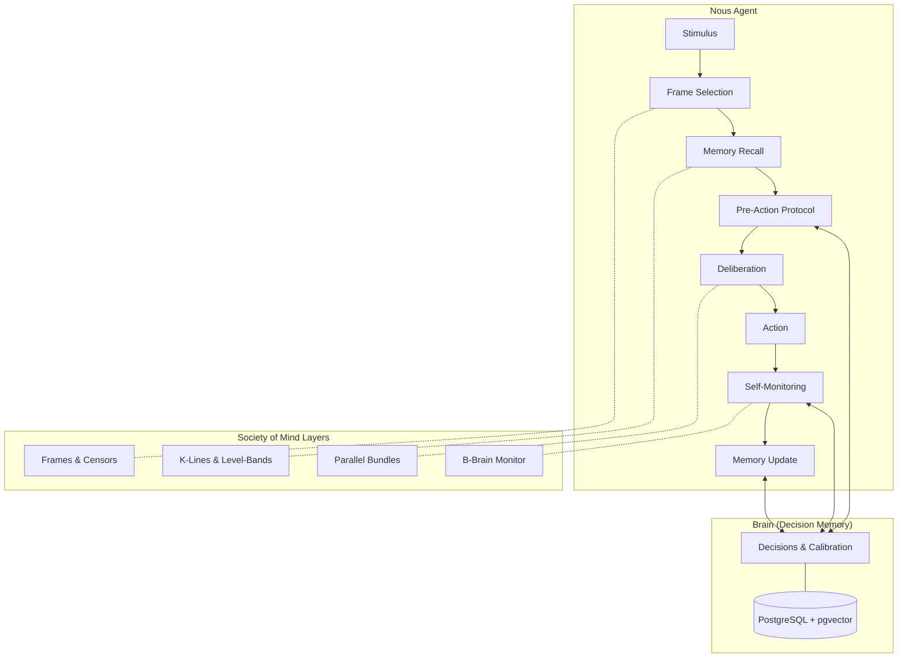
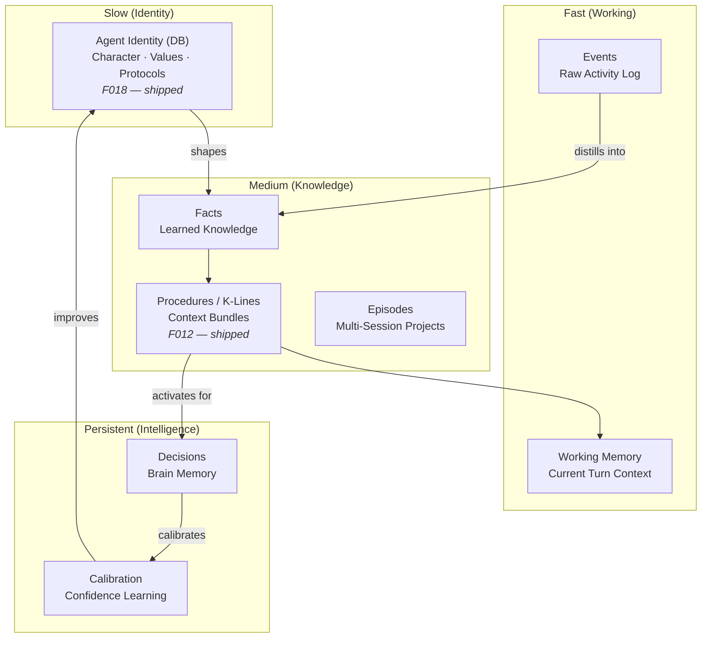
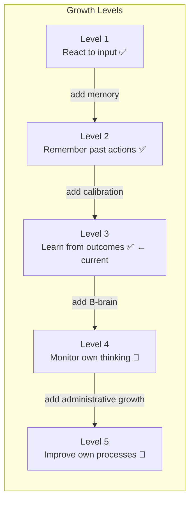
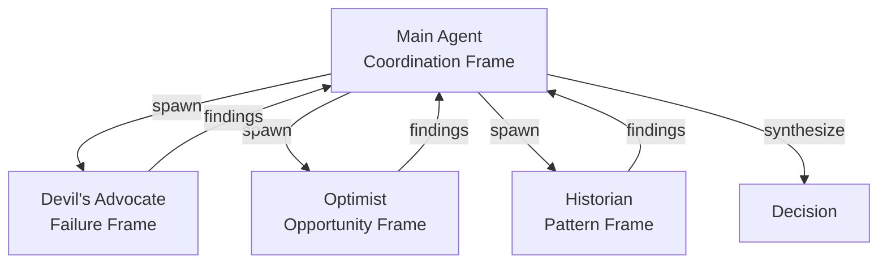

<p align="center">
  
</p>

# Nous

**A cognitive architecture for AI agents, grounded in Minsky's Society of Mind.**

Nous is a framework for building AI agents that think, learn, and grow — not just respond. It applies the decision intelligence principles proven by [Cognition Engines](https://github.com/tfatykhov/cognition-agent-decisions), and implements Marvin Minsky's Society of Mind principles as first-class architectural components.

> *"To explain the mind, we have to show how minds are built from mindless stuff."* — Marvin Minsky

**[Quickstart Guide →](docs/quickstart.md)** — Deploy Nous from scratch in minutes.

## Why Nous?

Current AI agents are stateless reactors. They receive a prompt, generate a response, and forget. Even agents with "memory" just store and retrieve text — there's no structure, no learning, no growth.

Nous is different. It gives agents:

- **Structured memory** that mirrors how minds actually work (not just vector search)
- **Decision intelligence** that learns from past choices and calibrates confidence
- **Self-monitoring** that catches mistakes before they happen
- **Administrative growth** — agents get smarter by managing themselves better, not just accumulating more knowledge

## Architecture Overview



## Core Concepts

### From Minsky

| Concept | Chapter | Nous Implementation | Status |
|---------|---------|----------------------|--------|
| K-Lines | Ch 8 | Context bundles with level-bands (upper fringe / core / lower fringe) | ✅ Shipped |
| Censors | Ch 9 | Guardrails that block actions, not modify them | ✅ Shipped |
| Papert's Principle | Ch 10 | Administrative growth through detours, not replacements | ✅ Shipped |
| Frames | Ch 25 | One active frame at a time; explicit frame-switching | ✅ Shipped |
| B-Brains | Ch 6 | Self-monitoring layer that watches the agent think | 🔄 Planned |
| Parallel Bundles | Ch 18 | Multiple independent reasons > one logical chain | ✅ Shipped (decisions) |
| Polynemes | Ch 19 | Tags as cross-agency activation signals | 🔄 Planned |
| Nemes | Ch 20 | Micro-features that constrain search (bridge-definitions) | 🔄 Planned |
| Pronomes | Ch 21 | Separation of assignment (what) from action (how) | 🔄 Planned |
| Attachment Learning | Ch 17 | Goal formation through reinforcement of subgoals | 🔄 Planned |

### From Cognition Engines

| Component | Role in Nous |
|-----------|---------------|
| Decision Memory | Long-term episodic memory for all agent choices |
| Pre-Action Protocol | Mandatory think-before-acting loop |
| Deliberation Traces | B-brain consciousness — recording thought as it happens |
| Calibration | Learning to trust your own confidence estimates |
| Guardrails | Censors that enforce boundaries |
| Bridge Definitions | Structure + function descriptions for semantic recall |
| Graph Store | Decision relationships and dependency tracking |

## The Nous Loop

Every agent action follows this cycle:

```
SENSE → FRAME → RECALL → DELIBERATE → ACT → MONITOR → LEARN
```

### 1. SENSE (Stimulus Reception)
The agent receives input — a message, an event, a timer. Raw perception.

### 2. FRAME (Interpretation)
Select a cognitive frame for interpreting the input. "Is this a bug report? A creative request? A decision point?" The frame determines which agencies activate.

**Minsky insight:** You can only hold one frame at a time (Necker cube). Frame-switching is explicit, not automatic. For important decisions, spawn parallel frames via sub-agents (Devil's Advocate, Optimist, etc.).

### 3. RECALL (Hybrid Memory Search)
Activate relevant K-lines — context bundles that reconstruct the mental state needed for this type of work. K-lines connect at three levels:

- **Upper fringe** (goals): weakly attached, may not apply
- **Core** (patterns & tools): strongly attached, the transferable knowledge
- **Lower fringe** (implementation details): easily displaced by current context

**Minsky insight:** Memory is reconstruction, not retrieval. You don't "find" old knowledge — you become a version of yourself that had it.

### 4. DELIBERATE (Pre-Action Protocol)
Before acting, query the decision memory:

1. **Query similar past decisions** — what happened when I faced this before?
2. **Check guardrails** — am I allowed to do this?
3. **Record intent** — capture the deliberation trace BEFORE acting
4. **Assess confidence** — how sure am I? (calibration feedback loop)

**Minsky insight:** Consciousness is menu lists, not deep access. The deliberation trace IS the thinking, not a record of it.

### 5. ACT (Execution)
Do the thing. While working, capture reasoning with micro-thoughts — the B-brain watches the A-brain work.

### 6. MONITOR (Self-Assessment)
After acting, the B-brain evaluates:
- Did the action match the intent?
- Were there unexpected consequences?
- Should a censor be activated for next time?

**Minsky insight:** Keep the watcher simple and rule-based. Meta-decisions about decision-making are recursive and dangerous.

### 7. LEARN (Memory Update)
Update memory at all levels:
- **Decision memory** — finalize the decision record with outcome
- **K-lines** — create or update context bundles if new patterns emerged
- **Calibration** — feed confidence vs outcome back into the system
- **Guardrails** — add new censors if a failure mode was discovered

## Memory Architecture



**Key principle:** Each layer learns to exploit the last, then stabilizes and becomes a foundation. Layers become substrates. The slowest-changing layers provide the most continuity.

## Growth Model

Nous agents grow through **Papert's Principle**: the most crucial steps in mental growth are based on acquiring new administrative ways to use what one already knows.

This means:
- **Don't add more knowledge** when an agent fails — add a better manager
- **Build detours, not replacements** — intercept existing behavior, don't rip it out
- **Friction beats reminders** — reduce the steps to do the right thing
- **Censors > modifications** — when something fails, add a blocker, don't alter the method



Most AI agents operate at Level 1-2. Nous is currently at **Level 3** (learning from outcomes via calibration). Levels 4-5 require B-Brain (self-monitoring) and administrative growth, both planned.

## Confidence & Calibration

Nous agents track their confidence and learn from it:

- Every decision records a confidence score (0.0 - 1.0)
- Outcomes are reviewed and compared to predictions
- **Brier scores** measure calibration accuracy over time
- Agents that say "80% confident" should be right ~80% of the time

**Fredkin's Paradox:** When two options seem equally good, the choice matters least. Stop agonizing at 0.50 confidence — pick one and move. Save deliberation energy for decisions where options are actually different.

## Frame-Splitting Protocol (🔄 Planned)

For important decisions, Nous will support **parallel cognitive frames** via sub-agents. The subtask infrastructure is in place; the multi-frame synthesis protocol is planned:



Each sub-agent will be locked into a single interpretive frame. The main agent will synthesize their perspectives. This will overcome Minsky's "one frame at a time" limitation through parallel processing. The subtask spawning infrastructure (`spawn_task`) already exists — what's needed is the frame-locking and synthesis protocol on top.

## Relationship to Cognition Engines

Nous applies the same decision intelligence principles proven by [Cognition Engines](https://github.com/tfatykhov/cognition-agent-decisions) — decisions, deliberation traces, calibration, guardrails, bridge definitions — but is a completely independent implementation.

**Same ideas, not same code.**

Cognition Engines is a standalone server for any AI agent that needs decision memory. Nous's Brain module is a purpose-built embedded implementation of those principles, optimized for in-process use with zero network overhead.

```
Cognition Engines  →  proved the ideas work (standalone server, MCP/JSON-RPC)
Nous Brain       →  applies those ideas as an embedded organ (Python library, Postgres)
```

Both projects evolve independently. The shared asset is the philosophy, not the codebase.

## Research Questions

1. **How much structure is optimal?** Too little and the agent doesn't learn. Too much and it's rigid. Where's the sweet spot?

2. **Can administrative growth be automated?** Papert's Principle says growth is about better managers. Can an agent bootstrap its own management layer?

3. **What's the minimum viable Society?** Which Minsky concepts are essential vs nice-to-have? What's the smallest set that produces emergent intelligence?

4. **How do frame conflicts resolve?** When parallel frames disagree, what's the arbitration mechanism?

5. **Does calibration plateau?** As decisions accumulate, does calibration continue improving or hit diminishing returns?

6. **Can K-lines transfer between agents?** If Agent A learns a K-line, can Agent B use it? What's lost in translation?

7. **How does Fredkin's Paradox interact with stakes?** Low-stakes decisions should resolve fast. High-stakes decisions need more deliberation. What's the mapping?

## Configuration

Key environment variables (see the [Quickstart Guide](docs/quickstart.md) for the full list):

| Variable | Default | Description |
|----------|---------|-------------|
| `NOUS_IDENTITY_PROMPT` | Built-in default | **Agent identity.** Injected as the first section of every system prompt. This is how Nous knows who it is and how to behave. Override to customize personality. |
| `NOUS_MODEL` | `claude-sonnet-4-6` | LLM model for the main agent loop |
| `NOUS_MAX_TURNS` | `10` | Max tool-use iterations per turn. Increase for complex multi-step tasks. |
| `NOUS_THINKING_MODE` | `off` | Extended thinking: `off`, `adaptive` (recommended for 4.6), or `manual` |
| `NOUS_EFFORT` | `high` | Thinking depth for adaptive mode: `low`, `medium`, `high`, `max` |
| `NOUS_EVENT_BUS_ENABLED` | `true` | Enable async event handlers (episode summarizer, fact extractor) |
| `NOUS_WORKSPACE_DIR` | `/tmp/nous-workspace` | Agent workspace directory |

**Context Quality (F016/F017):**

| Variable | Default | Description |
|----------|---------|-------------|
| `NOUS_CONTEXT_WINDOW` | auto | Override model context window size in tokens (0 = auto-detect from model name) |
| `NOUS_ANTI_HALLUCINATION_PROMPT` | `true` | Inject "don't guess, re-fetch" safety prompt into system context |
| `NOUS_TOOL_PRUNING_ENABLED` | `true` | Enable 4-tier tool result pruning (full → soft-trim → metadata-degrade → hard-clear) |
| `NOUS_TOOL_SOFT_TRIM_CHARS` | `4000` | Threshold above which tool results get soft-trimmed |
| `NOUS_TOOL_SOFT_TRIM_HEAD` | `1500` | Chars to keep from start when soft-trimming |
| `NOUS_TOOL_SOFT_TRIM_TAIL` | `1500` | Chars to keep from end when soft-trimming |
| `NOUS_TOOL_METADATA_DEGRADE_AFTER` | `8` | Tool result age (in results) before metadata degradation |
| `NOUS_TOOL_HARD_CLEAR_AFTER` | `12` | Tool result age before hard-clear replacement |
| `NOUS_KEEP_LAST_TOOL_RESULTS` | `2` | Number of most recent tool results always protected |
| `NOUS_COMPACTION_ENABLED` | `true` | Enable LLM-powered history compaction |
| `NOUS_COMPACTION_THRESHOLD` | auto | Token count triggering compaction (auto-scales per model context window) |
| `NOUS_KEEP_RECENT_TOKENS` | auto | Tokens to preserve during compaction (auto-scales per model) |
| `NOUS_RELEVANCE_FLOOR_ENABLED` | `true` | Enable per-type minimum score filtering on memory retrieval |
| `NOUS_RELEVANCE_DROP_RATIO` | `0.6` | Diminishing returns cutoff — stop at >40% score drops |
| `NOUS_BUDGET_SCALE_ENABLED` | `true` | Scale context budgets based on model context window |
| `NOUS_CONTEXT_BUDGET_OVERRIDES` | `{}` | JSON dict overriding per-frame context budget defaults (see example below) |
| `NOUS_STALENESS_PENALTY_ENABLED` | `true` | Apply time-decay penalty to memory scores |
| `NOUS_STALENESS_HALF_LIFE_DAYS` | `14` | Half-life in days for staleness decay |
| `NOUS_TOOL_TIMEOUT` | `120` | Max seconds for any single tool execution |
| `NOUS_KEEPALIVE_INTERVAL` | `10` | Seconds between keepalive events during tool execution |

**Context Budget Overrides Example:**

Each cognitive frame (task, question, decision, etc.) has built-in budgets for context assembly. Use `NOUS_CONTEXT_BUDGET_OVERRIDES` to tune these globally:

```bash
# Double the total budget and increase decision memory allocation
NOUS_CONTEXT_BUDGET_OVERRIDES='{"total": 16000, "decisions": 4000, "facts": 3000}'
```

**Token budgets** (max estimated tokens per section): `total`, `identity`, `user_profile`, `censors`, `frame`, `working_memory`, `decisions`, `facts`, `procedures`, `episodes`.

**Turn budget** (not tokens): `conversation_window` — number of recent user turns checked for dedup, so the context engine doesn't inject memories already visible in the conversation.

Overrides apply on top of each frame's defaults — unspecified keys keep their per-frame values.

## Status

🚀 **v0.1.0 — shipped and deployed.**

All core architecture is implemented and running:

| Component | Status | Description |
|-----------|--------|-------------|
| Brain (F001) | ✅ Shipped | Decision recording, deliberation traces, calibration, guardrails, graph |
| Heart (F002) | ✅ Shipped | Episodes, facts, procedures, censors, working memory |
| Cognitive Layer (F003) | ✅ Shipped | Frame selection, recall, deliberation, monitoring, reflection |
| Runtime (F004) | ✅ Shipped | REST API (57 endpoints), MCP server (5 tools), Telegram bot |
| Context Engine (F005) | ✅ Shipped | Tiered context (always-on identity + search thresholds), token budgets, dedup |
| Event Bus (F006) | ✅ Shipped | In-process async bus with 13 automated handlers |
| Memory Improvements (F010) | ✅ Shipped | Episode summaries, fact extraction, user tagging |
| Context Quality (006.2) | ✅ Shipped | Fact supersession, episode dedup, abandoned filtering |
| Sleep Consolidation | ✅ Shipped | 5-phase biological sleep cycle: memory decay, consolidation, pattern extraction, optimization, integrity checks |
| Extended Thinking (007) | ✅ Shipped | Adaptive thinking, interleaved reasoning, thinking indicators |
| Context Recall (007.2-007.5) | ✅ Shipped | Topic-aware recall, informational detection, relevance thresholds |
| Agent Identity (008/F018) | ✅ Shipped | DB-backed identity, initiation protocol, tiered context, REST API |
| Conversation Compaction (008.1) | ✅ Shipped | Tool output pruning, history compaction, durable persistence (3 phases) |
| Streaming & Reliability | ✅ Shipped | Keepalive during Anthropic wait, tool timeout, typing indicators |
| Topic Persistence | ✅ Shipped | Follow-up detection, current_task preservation across turns |
| Deliberation Capture | ✅ Shipped | Extended thinking blocks → deliberation traces, garbage cleanup |
| Episode Summary Quality (008.3-008.4) | ✅ Shipped | Backfill + enhanced prompt, candidate_facts, smart truncation, decision context |
| Context Pruning (F016) | ✅ Shipped | 4-tier tool pruning, anti-hallucination prompt, model-aware compaction, content-type decay profiles, pre-prune fact extraction |
| Context Quality Gate (F017) | ✅ Shipped | Relevance floor, diminishing returns cutoff, staleness penalty, model-aware budget scaling, usage tracking |
| K-Line Learning (F012) | ✅ Shipped | Auto-create procedures from decision clusters, episode lessons, error recovery |
| Skill Discovery (F011) | ✅ Shipped | learn_skill tool, SkillParser, bootstrap, auto-activation via RECALL |
| Graph-Augmented Recall (F022) | ✅ Shipped | Polymorphic graph edges, cross-type linking, contradiction bridge, spreading activation |
| Async Subtasks (F009) | ✅ Shipped | Background task queue, worker pool, scheduling, time parser, inline subtask execution |
| Memory Admission Control (F023) | ✅ Shipped | 5-dimension scoring, LLM utility assessment, shadow mode |
| Critic Agent (F024) | ✅ Phase 0 | Smart frame selector, LLM classification, 6 diagnostic critics |
| Self-Modifying Rubrics (F024-3b) | ✅ Shipped | Outcome signals, dimension proposals, approval flow, rubric evolution, dashboard tab |
| Execution Integrity (F026) | ✅ Shipped | Execution ledger, tiered action gating, claim verification, ghost planning detection |
| MMR Diversity (F030) | ✅ Shipped | Maximal Marginal Relevance re-ranking in recall_deep |
| Censor Middleware (F031) | ✅ Shipped | Censors execute read-only tools, conditional unblock, action payloads, update API |
| Execution Ledger Dashboard (F032) | ✅ Shipped | Per-action visibility, status filtering, timeline view, side-effect classification |
| Multi-Tier Search (F033) | ✅ Shipped | Tavily primary + Exa research + Brave fallback, query classification router |
| Heartbeat Monitoring (F034) | ✅ Shipped | Proactive tick loop, health/email/self-initiated checks, triage, Telegram alerts |
| Finding Lifecycle (F034.1) | ✅ Shipped | Fingerprint dedup, state machine (new→ack→resolved), escalation, daily digest |
| Intelligent Checks (F034.2) | ✅ Shipped | Embedding search, LLM email classification, tunable parameters |
| Self-Tuning Heartbeat (F034.3) | ✅ Shipped | Outcome-driven parameter adjustment, cross-cycle rollback, pinned params |
| Phase 1 Voice | ✅ Shipped | Email, Telegram notify, Emerson A2A — zero code changes via procedures |

**Stats:** ~72,000 lines of Python (35K production + 37K tests) · 2,000+ tests across 106 files · 27 Postgres tables · 57 REST endpoints · 19 agent tools · Docker deployment

See [Feature Index](docs/features/INDEX.md) for the full breakdown.

## License

Apache 2.0

## Acknowledgments

- **Marvin Minsky** — *Society of Mind* (1986) provides the theoretical foundation
- **Cognition Engines** — proved the decision intelligence principles that Nous applies independently
- Built with curiosity and too much coffee ☕
