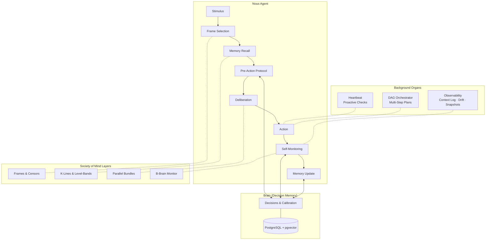
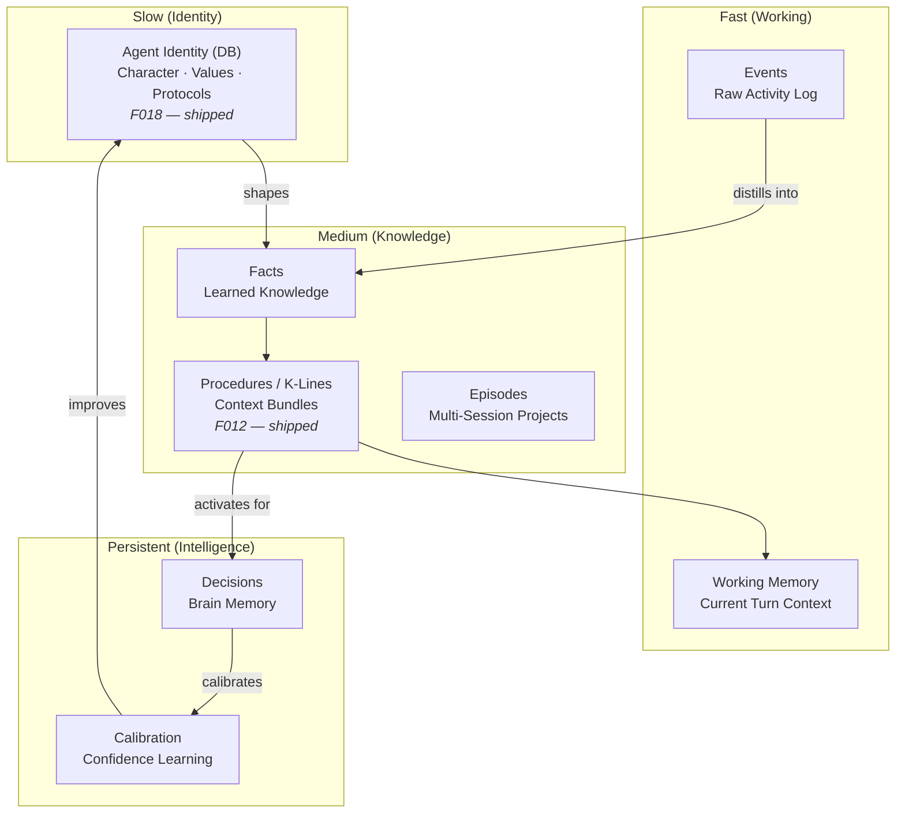
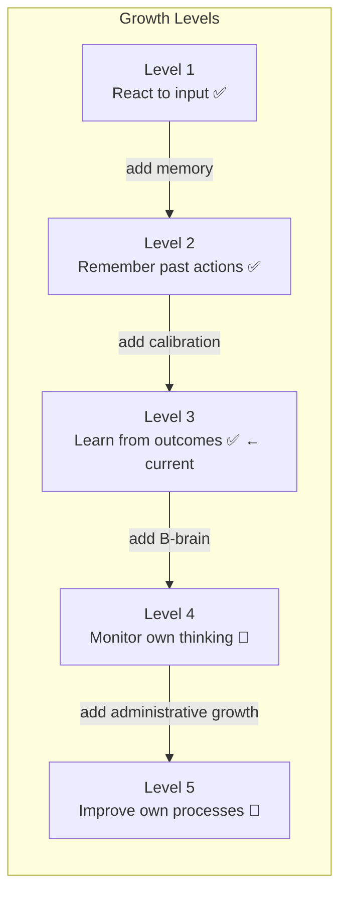
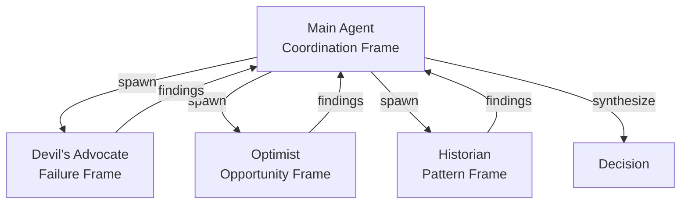

<p align="center">
  
</p>

# Nous

**A cognitive architecture for AI agents, grounded in Minsky's Society of Mind.**

Nous is a framework for building AI agents that think, learn, and grow — not just respond. It applies the decision intelligence principles proven by [Cognition Engines](https://github.com/tfatykhov/cognition-agent-decisions), and implements Marvin Minsky's *Society of Mind* principles as first-class architectural components.

> *"To explain the mind, we have to show how minds are built from mindless stuff."* — Marvin Minsky

**[Quickstart Guide →](docs/quickstart.md)** — Deploy Nous from scratch in minutes.

## Why Nous?

Current AI agents are stateless reactors. They receive a prompt, generate a response, and forget. Even agents with "memory" just store and retrieve text — there's no structure, no learning, no growth.

Nous is different. It gives agents:

- **Structured memory** that mirrors how minds actually work (not just vector search)
- **Decision intelligence** that learns from past choices and calibrates confidence
- **Self-monitoring** that catches mistakes before they happen
- **Proactive autonomy** — agents notice things on their own, not only when prompted
- **Administrative growth** — agents get smarter by managing themselves better, not just accumulating more knowledge

## Architecture Overview



## Core Concepts

### From Minsky

| Concept | Chapter | Nous Implementation | Status |
|---------|---------|----------------------|--------|
| K-Lines | Ch 8 | Context bundles with level-bands (upper fringe / core / lower fringe) | ✅ Shipped |
| Censors | Ch 9 | Guardrails that block actions, not modify them | ✅ Shipped |
| Papert's Principle | Ch 10 | Administrative growth through detours, not replacements | ✅ Shipped |
| Frames | Ch 25 | One active frame at a time; explicit frame-switching | ✅ Shipped |
| B-Brains | Ch 6 | Self-monitoring layer that watches the agent think | 🔄 Phase 0 (Critic Agent) |
| Parallel Bundles | Ch 18 | Multiple independent reasons > one logical chain | ✅ Shipped (decisions) |
| Polynemes | Ch 19 | Tags as cross-agency activation signals | 🔄 Planned |
| Nemes | Ch 20 | Micro-features that constrain search (bridge-definitions) | 🔄 Planned |
| Pronomes | Ch 21 | Separation of assignment (what) from action (how) | 🔄 Planned |
| Attachment Learning | Ch 17 | Goal formation through reinforcement of subgoals | 🔄 Planned |

### From Cognition Engines

| Component | Role in Nous |
|-----------|---------------|
| Decision Memory | Long-term episodic memory for all agent choices |
| Pre-Action Protocol | Mandatory think-before-acting loop |
| Deliberation Traces | B-brain consciousness — recording thought as it happens |
| Calibration | Learning to trust your own confidence estimates |
| Guardrails | Censors that enforce boundaries |
| Bridge Definitions | Structure + function descriptions for semantic recall |
| Graph Store | Decision relationships and dependency tracking |

## The Nous Loop

Every agent action follows this cycle:

```
SENSE → FRAME → RECALL → DELIBERATE → ACT → MONITOR → LEARN
```

### 1. SENSE (Stimulus Reception)
The agent receives input — a message, an event, a timer. Raw perception.

### 2. FRAME (Interpretation)
Select a cognitive frame for interpreting the input. "Is this a bug report? A creative request? A decision point?" The frame determines which agencies activate.

**Minsky insight:** You can only hold one frame at a time (Necker cube). Frame-switching is explicit, not automatic. For important decisions, spawn parallel frames via sub-agents (Devil's Advocate, Optimist, etc.).

### 3. RECALL (Hybrid Memory Search)
Activate relevant K-lines — context bundles that reconstruct the mental state needed for this type of work. K-lines connect at three levels:

- **Upper fringe** (goals): weakly attached, may not apply
- **Core** (patterns & tools): strongly attached, the transferable knowledge
- **Lower fringe** (implementation details): easily displaced by current context

**Minsky insight:** Memory is reconstruction, not retrieval. You don't "find" old knowledge — you become a version of yourself that had it.

### 4. DELIBERATE (Pre-Action Protocol)
Before acting, query the decision memory:

1. **Query similar past decisions** — what happened when I faced this before?
2. **Check guardrails** — am I allowed to do this?
3. **Record intent** — capture the deliberation trace BEFORE acting
4. **Assess confidence** — how sure am I? (calibration feedback loop)

**Minsky insight:** Consciousness is menu lists, not deep access. The deliberation trace IS the thinking, not a record of it.

### 5. ACT (Execution)
Do the thing. While working, capture reasoning with micro-thoughts — the B-brain watches the A-brain work.

### 6. MONITOR (Self-Assessment)
After acting, the B-brain evaluates:
- Did the action match the intent?
- Were there unexpected consequences?
- Should a censor be activated for next time?

**Minsky insight:** Keep the watcher simple and rule-based. Meta-decisions about decision-making are recursive and dangerous.

### 7. LEARN (Memory Update)
Update memory at all levels:
- **Decision memory** — finalize the decision record with outcome
- **K-lines** — create or update context bundles if new patterns emerged
- **Calibration** — feed confidence vs outcome back into the system
- **Guardrails** — add new censors if a failure mode was discovered

## Memory Architecture



**Key principle:** Each layer learns to exploit the last, then stabilizes and becomes a foundation. Layers become substrates. The slowest-changing layers provide the most continuity.

Memory is stored in PostgreSQL with pgvector across three schemas — `brain` (decisions, calibration, graph), `heart` (facts, procedures, episodes, censors, working memory, subtasks, schedules), and `nous_system` (agents, identity, events, DAGs, dynamic checks, config). Every row is `agent_id`-scoped so a single database can host many agents.

## Growth Model

Nous agents grow through **Papert's Principle**: the most crucial steps in mental growth are based on acquiring new administrative ways to use what one already knows.

This means:
- **Don't add more knowledge** when an agent fails — add a better manager
- **Build detours, not replacements** — intercept existing behavior, don't rip it out
- **Friction beats reminders** — reduce the steps to do the right thing
- **Censors > modifications** — when something fails, add a blocker, don't alter the method



Most AI agents operate at Level 1-2. Nous is currently at **Level 3** (learning from outcomes via calibration). Levels 4-5 require a fully autonomous B-Brain and administrative growth — Phase 0 of the Critic Agent (F024) is shipped, the rest is planned.

## Confidence & Calibration

Nous agents track their confidence and learn from it:

- Every decision records a confidence score (0.0 - 1.0)
- Outcomes are reviewed and compared to predictions
- **Brier scores** measure calibration accuracy over time
- Agents that say "80% confident" should be right ~80% of the time

A separate write-time **calibration scale** (F058) shrinks agent-recorded confidence toward observed accuracy — the default factor (`0.7627`) is derived empirically from a 401-decision audit and can be tuned per deployment via `NOUS_CONFIDENCE_CALIBRATION_FACTOR`. The pre-calibration value is preserved in `brain.decisions.confidence_raw`.

**Fredkin's Paradox:** When two options seem equally good, the choice matters least. Stop agonizing at 0.50 confidence — pick one and move. Save deliberation energy for decisions where options are actually different.

## Frame-Splitting Protocol (🔄 Planned)

For important decisions, Nous will support **parallel cognitive frames** via sub-agents. The subtask infrastructure (and now a full DAG orchestrator) is in place; the multi-frame synthesis protocol is the remaining work:



Each sub-agent will be locked into a single interpretive frame. The main agent will synthesize their perspectives. This will overcome Minsky's "one frame at a time" limitation through parallel processing. `spawn_task` and the DAG orchestrator already provide the spawning fabric — what's needed is the frame-locking and synthesis protocol on top.

## Relationship to Cognition Engines

Nous applies the same decision intelligence principles proven by [Cognition Engines](https://github.com/tfatykhov/cognition-agent-decisions) — decisions, deliberation traces, calibration, guardrails, bridge definitions — but is a completely independent implementation.

**Same ideas, not same code.**

Cognition Engines is a standalone server for any AI agent that needs decision memory. Nous's Brain module is a purpose-built embedded implementation of those principles, optimized for in-process use with zero network overhead.

```
Cognition Engines  →  proved the ideas work (standalone server, MCP/JSON-RPC)
Nous Brain         →  applies those ideas as an embedded organ (Python library, Postgres)
```

Both projects evolve independently. The shared asset is the philosophy, not the codebase.

## Research Questions

1. **How much structure is optimal?** Too little and the agent doesn't learn. Too much and it's rigid. Where's the sweet spot?

2. **Can administrative growth be automated?** Papert's Principle says growth is about better managers. Can an agent bootstrap its own management layer?

3. **What's the minimum viable Society?** Which Minsky concepts are essential vs nice-to-have? What's the smallest set that produces emergent intelligence?

4. **How do frame conflicts resolve?** When parallel frames disagree, what's the arbitration mechanism?

5. **Does calibration plateau?** As decisions accumulate, does calibration continue improving or hit diminishing returns?

6. **Can K-lines transfer between agents?** If Agent A learns a K-line, can Agent B use it? What's lost in translation?

7. **How does Fredkin's Paradox interact with stakes?** Low-stakes decisions should resolve fast. High-stakes decisions need more deliberation. What's the mapping?

## Configuration

Key environment variables. See the [Quickstart Guide](docs/quickstart.md) and [CLAUDE.md](CLAUDE.md) for the full list — Nous exposes 150+ env vars covering retrieval, calibration, heartbeat, DAGs, and the eval harness.

| Variable | Default | Description |
|----------|---------|-------------|
| `NOUS_IDENTITY_PROMPT` | Built-in default | **Agent identity.** Injected as the first section of every system prompt. Override to customize personality. |
| `NOUS_MODEL` | `claude-sonnet-4-6` | LLM model for the main agent loop |
| `NOUS_MAX_TURNS` | `10` | Max tool-use iterations per turn |
| `NOUS_BACKGROUND_MODEL` | `claude-sonnet-4-6` | Model used for background tasks (subtasks, heartbeat, sleep) |
| `NOUS_EVENT_BUS_ENABLED` | `true` | Enable async event handlers (episode summarizer, fact extractor, graph linker, etc.) |
| `NOUS_HEARTBEAT_ENABLED` | `true` | Enable proactive monitoring tick loop (F034) |
| `NOUS_DAG_ENABLED` | `true` | Enable DAG orchestrator for multi-step plans (F038/F046/F064) |

**Retrieval & context quality:**

| Variable | Default | Description |
|----------|---------|-------------|
| `NOUS_CONTEXT_WINDOW` | auto | Override model context window in tokens (0 = auto-detect) |
| `NOUS_TOOL_PRUNING_ENABLED` | `true` | 4-tier tool result pruning (full → soft-trim → metadata-degrade → hard-clear) (F016) |
| `NOUS_COMPACTION_ENABLED` | `true` | LLM-powered history compaction with entity-substring hallucination guard (F059) |
| `NOUS_RELEVANCE_FLOOR_ENABLED` | `true` | Per-type minimum-score filter on memory retrieval (F017) |
| `NOUS_STALENESS_PENALTY_ENABLED` | `true` | Time-decay penalty on memory scores |
| `NOUS_STALENESS_HALF_LIFE_DAYS` | `30` | Half-life for staleness decay |
| `NOUS_MMR_ENABLED` | `false` | Maximal Marginal Relevance diversity re-ranking (F030) |
| `NOUS_CROSS_ENCODER_ENABLED` | `false` | Cross-encoder reranking in `recall_deep` (F042; requires `sentence-transformers`) |
| `NOUS_GRAPH_RECALL_ENABLED` | `true` | Spreading activation on the polymorphic graph during recall (F022) |
| `NOUS_GRAPH_BACKFILL_ENABLED` | `true` | Sleep-cycle graph densification for orphan memories (F040) |

**Decision intelligence:**

| Variable | Default | Description |
|----------|---------|-------------|
| `NOUS_CONFIDENCE_CALIBRATION_FACTOR` | `0.7627` | Write-time scale on agent-recorded decision confidence (F058). Set to `1.0` to disable. |
| `NOUS_ACTION_GATING_ENABLED` | `true` | Tiered action gating before write/external/irreversible tools (F026) |
| `NOUS_CLAIM_VERIFICATION_ENABLED` | `true` | Post-turn claim verification against execution ledger (F026) |
| `NOUS_RUBRIC_ENABLED` | `true` | Self-modifying decision-quality rubric (F024-3b) |

For the full set — heartbeat tuning, DAG timeouts, sleep cycle, eval harness — see [CLAUDE.md](CLAUDE.md).

## Status

🚀 **v0.1.0 — shipped and deployed.**

All core architecture is implemented and running. Recent work focuses on retrieval quality, background reliability, and orchestration.

### Core architecture

| Component | Status | Description |
|-----------|--------|-------------|
| Brain (F001) | ✅ Shipped | Decision recording, deliberation traces, calibration, guardrails, graph |
| Heart (F002) | ✅ Shipped | Episodes, facts, procedures, censors, working memory |
| Cognitive Layer (F003) | ✅ Shipped | Frame selection, recall, deliberation, monitoring, end-of-session reflection |
| Runtime (F004) | ✅ Shipped | REST API, MCP server, Telegram bot, Anthropic API client |
| Context Engine (F005) | ✅ Shipped | Frame-adaptive context assembly, token budgets, dedup |
| Event Bus (F006) | ✅ Shipped | In-process async bus with automated handlers |
| Async Subtasks (F009) | ✅ Shipped | Background task queue, worker pool, scheduling, inline subtask execution |
| Memory Improvements (F010) | ✅ Shipped | Episode summaries, fact extraction, user tagging |
| Skill Discovery (F011) | ✅ Shipped | `learn_skill` tool, SkillParser, bootstrap, auto-activation via RECALL |
| K-Line Learning (F012) | ✅ Shipped | Auto-create procedures from decision clusters, episode lessons, error recovery |
| Agent Identity (F018) | ✅ Shipped | DB-backed identity, initiation protocol, tiered context, REST API |
| Tool Output Intelligence (F020) | ✅ Shipped | SmartCompress ingestion-time compression + Postgres-backed ReversibleCache |
| Memory Dashboard (F021) | ✅ Shipped | SPA: overview, browser, graph, calibration, activity, health, admission |
| Graph-Augmented Recall (F022) | ✅ Shipped | Polymorphic edges, cross-type linking, contradiction bridge, spreading activation |
| Memory Admission Control (F023) | ✅ Shipped | 5-dimension scoring, LLM utility assessment, shadow mode |
| Critic Agent (F024) | ✅ Phase 0 | Smart frame selector, LLM classification, 6 diagnostic critics |
| Self-Modifying Rubrics (F024-3b) | ✅ Shipped | Outcome signals, dimension proposals, rubric evolution, dashboard tab |
| Amnesia Prevention (F025) | ✅ Shipped | Staleness exemptions, budget scaling, 16K transcript, chunked summarization |
| Execution Integrity (F026) | ✅ Shipped | Execution ledger, tiered action gating, claim verification, ghost-planning detection |
| Context Pruning + Quality Gate (F016 / F017) | ✅ Shipped | 4-tier pruning, anti-hallucination prompt, relevance floor, staleness penalty |

### Retrieval & memory quality

| Feature | Status | Description |
|---------|--------|-------------|
| MMR Diversity (F030) | ✅ Shipped | Maximal Marginal Relevance re-ranking in `recall_deep`, per-consumer override (F030.2) |
| Memory Quality Fixes (F038) | ✅ Shipped | Quality gate 0.55, fact 30-char min, procedure floor 0.40, episode recency, task synthesis |
| Graph Densification (F040) | ✅ Shipped | Orphan backfill, reverse linking, per-relation thresholds, density dashboard |
| Cross-Encoder Reranking (F042) | ✅ Shipped | Sigmoid-normalized CE rerank, async, head-truncation, feature-flagged |
| CE Sleep Backfill (F043) | ✅ Shipped | CE precision pre-filter before cosine gate during graph densification |
| CE-Aware Thresholds (F045 / F054) | ✅ Shipped | Relaxed per-relation thresholds + content guards, empirically validated |
| Actionability Classification (F047) | ✅ Shipped | Learn-time `actionable: bool` on facts (tier-1 hard filter → heuristic → Haiku LLM) |
| Multi-Query Expansion (F050) | 🌑 Dark | Haiku-driven query expansion; module shipped, flag-flip gated on F051 harness |
| Retrieval Eval Harness (F051) | ✅ Shipped | Local-first eval pipeline, per-source qrels, paired A/B configs, persistent eval-DB image |
| Sleep-Phase Cleanup (F053 / F054) | ✅ Shipped | Orphan-edge sweep + keyword-channel toggle, addresses density-eval findings |
| Episode Re-Linker (F057) | ✅ Shipped | Sleep phase that backfills F022 links missed at write time |

### Proactive autonomy & orchestration

| Feature | Status | Description |
|---------|--------|-------------|
| Censor Middleware (F031) | ✅ Shipped | Censors execute read-only tools, conditional unblock, action payloads, update API |
| Execution Ledger Dashboard (F032) | ✅ Shipped | Per-action visibility, status filtering, timeline view, side-effect classification |
| Multi-Tier Search (F033) | ✅ Shipped | Tavily primary + Exa research + Brave fallback, query classification router |
| Heartbeat Monitoring (F034) | ✅ Shipped | Proactive tick loop, health/email/self-initiated checks, triage, Telegram alerts |
| Finding Lifecycle (F034.1) | ✅ Shipped | Fingerprint dedup, state machine (new→ack→resolved), escalation, daily digest |
| Intelligent Checks (F034.2) | ✅ Shipped | Embedding search, LLM email classification, tunable parameters |
| Self-Tuning Heartbeat (F034.3) | ✅ Shipped | Outcome-driven parameter adjustment, cross-cycle rollback, pinned params |
| Dynamic Heartbeat Checks (F034.5 / F034.6) | ✅ Shipped | Prompt-driven checks, conversational lifecycle, `on_complete` callback |
| Prompt Cache Optimization (F036) | ✅ Shipped | 3-tier system prompt split, cache break detection, tool schema cache |
| DAG Orchestration (F038 / F046 / F064) | ✅ Shipped | DAGStore + Orchestrator, env-driven node timeouts, stall detection, per-frame concurrency caps, workspace safety, scheduled-task continuation, work-queue ingress |
| Background Streaming + TCP Keep-Alive (F048) | ✅ Shipped | Subtask/heartbeat turns stream via SSE; socket keep-alive on httpx transport |
| Session & Memory Lifecycle Hygiene (F049) | ✅ Shipped | Bounded subtask cleanup, advisory-locked working-memory TTL sweep |
| Compaction Hallucination Guard (F059) | ✅ Shipped | Entity-substring check on compaction summary; events persisted to `nous_system.events` |
| Abandoned-Episode Recovery (F060) | ✅ Shipped | Three-path sleep phase: full transcript / summary fallback / mark abandoned |
| Subtask Hardening (F061) | ✅ Shipped | Schema + contract + dashboard pieces for subtask reliability |
| Symphony Orchestration Adoptions (F064) | 🟡 v1 partial | Stall detection, per-frame concurrency caps, workspace safety, work-queue ingress (v1 shipped); manifest enforcement + LLM thread continuity deferred to v2 |

See [Feature Index](docs/features/INDEX.md) for the full breakdown including planned and shelved work.

### Stats

Measured against the current `main` branch:

- **~53,400 lines** of production Python (`nous/`, 129 modules across 12 sub-packages: `api`, `brain`, `cognitive`, `dag`, `handlers`, `heart`, `heartbeat`, `identity`, `integrations`, `observability`, `skills`, `storage`), plus a sibling `nous_eval/` retrieval-eval harness
- **~75,900 lines** of tests (`tests/`, 227 files, 2,200+ top-level test functions)
- **25 agent tools** registered in the dispatcher: `record_decision`, `learn_fact`, `recall_deep`, `recall_recent`, `learn_skill`, `get_procedure`, `create_censor`, `cache_retrieve`, `bash`, `read_file`, `write_file`, `web_search`, `web_fetch`, `run_python`, `spawn_task`, `schedule_task`, `list_tasks`, `cancel_task`, `send_file`, `store_identity`, `complete_initiation`, `heartbeat_check_create`, `heartbeat_check_manage`, `dag_create`, `dag_manage`
- **81 REST endpoints** (`/chat`, `/decisions`, `/episodes`, `/facts`, `/identity`, `/heartbeat`, `/rubric`, `/dashboard/*`, …) + **5 MCP tools** (`nous_chat`, `nous_recall`, `nous_status`, `nous_teach`, `nous_decide`) + Telegram bot
- **37 PostgreSQL tables** across 3 schemas (`brain`, `heart`, `nous_system`) with **38 migrations** in `sql/migrations/`
- **Docker deployment**: PostgreSQL + pgvector container, Nous agent container, optional Telegram bot container, optional eval-DB container

## License

Apache 2.0

## Acknowledgments

- **Marvin Minsky** — *Society of Mind* (1986) provides the theoretical foundation
- **Cognition Engines** — proved the decision intelligence principles that Nous applies independently
- Built with curiosity and too much coffee ☕
