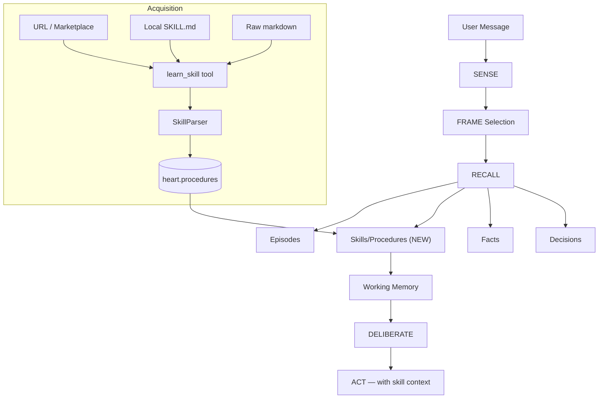

# F011 — Skill Discovery & Auto-Activation

> **Status:** Planned
> **Priority:** P1
> **Depends on:** F003 (Cognitive Layer), F002 (Heart — Procedures), F012 (K-Line Learning)
> **Estimated effort:** ~4-6 hours
> **Spec version:** v2 — revised 2026-03-09 (simplified acquisition model)

## Problem

Nous has skills (code-review, serper, web tools) stored as files in the workspace, but:
- **No registration** — skills aren't in the procedure registry the cognitive loop can search
- **No auto-activation** — the agent must manually recall skill existence from facts
- **No matching** — there's no mechanism to match incoming tasks to relevant skills
- **No loading** — skill context (instructions, tool paths, patterns) isn't injected into working memory

Currently, skill awareness depends entirely on facts learned via `learn_fact`. If the fact isn't recalled (wrong query, low similarity), the skill is invisible.

## Solution

Use the existing **Procedure** system in Heart as the skill registry — it already has everything needed. The missing piece is a single acquisition path: a `learn_skill` tool that parses a SKILL.md file from **any source** (URL, marketplace, local path, raw markdown) and registers it as a durable procedure in the DB.

**Key insight:** Once registered, a skill lives in `heart.procedures` (Postgres). It doesn't need to be on disk to survive restarts. The filesystem was never the right source of truth — the DB is.

### What changes from v1 spec

| v1 (original) | v2 (this spec) |
|---------------|----------------|
| Filesystem scanner runs on every startup | One-time bootstrap only (empty DB) |
| Skills coupled to deployed files | Skills live in DB, source-independent |
| No marketplace support | URL/marketplace first-class |
| Restart required to add new skill | Add skills mid-conversation |
| Separate indexer module | Single `learn_skill` tool + parser |

## Architecture



### Skill Discovery at RECALL (unchanged from v1)

1. **FRAME** has already classified the task type (task, decision, debug, conversation, creative)
2. **RECALL** searches all memory types — procedures/skills are a natural extension
3. Matched skills load into **Working Memory** as high-relevance items
4. **Context Engine** already has a procedures budget slot at priority 7 — just needs data

## Design

### 1. Skill Manifest (SKILL.md frontmatter)

Add structured YAML frontmatter to SKILL.md files. This is the machine-readable contract:

```yaml
---
name: serper-search
description: Google search via Serper.dev API
domain: research
triggers:
  - web search
  - google
  - find online
  - research
  - look up
frames:
  - task
  - debug
tools:
  - web_search
  - web_fetch
requires:
  - SERPER_API_KEY
source_url: https://clawhub.com/skills/serper    # optional, for marketplace skills
version: "1.0"                                    # optional
---
```

Fields:
- `name` — unique skill identifier (used for dedup)
- `description` — one-line summary, used as embedding seed
- `domain` — procedure domain (research, debugging, code-review, etc.)
- `triggers` — phrases that should activate this skill at RECALL
- `frames` — cognitive frames that boost this skill (+0.2 score)
- `tools` — tools this skill provides or enhances
- `requires` — environment variables that must be set (missing = `active=False`)
- `source_url` — where it came from (marketplace URL, GitHub raw link, etc.)
- `version` — optional version string for update tracking

### 2. `learn_skill` Tool

The primary acquisition path. Exposed to the model like `learn_fact`.

```python
async def learn_skill(
    source: str,          # URL, local path, or "inline"
    content: str | None,  # raw markdown if source="inline"
) -> dict:
    """
    Register a skill from a URL, local path, or raw markdown.

    Examples:
      learn_skill(source="https://clawhub.com/skills/serper/SKILL.md")
      learn_skill(source="skills/code-review/SKILL.md")
      learn_skill(source="inline", content="---\\nname: my-skill\\n...\\n---\\n# My Skill...")
    """
```

**Behaviour:**
1. Fetch content (web_fetch for URLs, read_file for local paths, use `content` directly for inline)
2. Parse SKILL.md frontmatter → `SkillManifest`
3. Check `requires` env vars → set `active=False` if any missing, log warning
4. Dedup: search existing procedures by name — update if found, create if not
5. Call `heart.store_procedure()` → durable in DB with embedding
6. Return `{name, id, active, message}`

**Tool schema:**
```json
{
  "type": "object",
  "properties": {
    "source": {
      "type": "string",
      "description": "URL, local file path relative to workspace, or 'inline' for raw content"
    },
    "content": {
      "type": "string",
      "description": "Raw SKILL.md markdown when source is 'inline'"
    }
  },
  "required": ["source"]
}
```

### 3. SkillParser (`nous/skills/parser.py`)

Single module. No scanner, no file watcher — just parsing logic.

```python
@dataclass
class SkillManifest:
    name: str
    description: str
    domain: str
    triggers: list[str]
    frames: list[str]
    tools: list[str]
    requires: list[str]
    source_url: str | None
    version: str | None
    raw_content: str           # full SKILL.md text after frontmatter
    first_section: str         # first H2 block — used in working memory compact format

class SkillParser:
    def parse(self, markdown: str, source_hint: str | None = None) -> SkillManifest:
        """Parse SKILL.md markdown into SkillManifest. Raises ValueError if frontmatter missing."""
        ...

    def to_procedure_input(self, manifest: SkillManifest) -> ProcedureInput:
        """Convert SkillManifest to ProcedureInput for heart.store_procedure()."""
        return ProcedureInput(
            name=manifest.name,
            domain=manifest.domain,
            description=manifest.description,
            goals=manifest.triggers,              # upper fringe — when to activate
            core_tools=manifest.tools,            # middle — what tools it uses
            core_patterns=manifest.triggers,      # middle — activation patterns
            core_concepts=[manifest.domain],      # middle — domain concepts
            implementation_notes=[               # lower fringe — source + version
                manifest.source_url or "local",
                f"version:{manifest.version}" if manifest.version else "",
            ],
            tags=["skill"] + manifest.frames,
        )
```

### 4. Bootstrap (fresh install only)

On startup, if `heart.procedures` has zero rows with tag `skill`:

```python
async def bootstrap_local_skills(workspace_dir: str, heart: Heart) -> int:
    """
    One-time bootstrap: register local SKILL.md files when DB is empty.
    Runs once, never again (DB becomes source of truth after this).
    """
    skills_dir = Path(workspace_dir) / "skills"
    if not skills_dir.exists():
        return 0

    count = await heart.count_procedures(tags=["skill"])
    if count > 0:
        return 0  # already bootstrapped — don't re-scan

    registered = 0
    for skill_dir in skills_dir.iterdir():
        skill_md = skill_dir / "SKILL.md"
        if skill_md.exists():
            await _register_from_path(skill_md, heart)
            registered += 1

    logger.info(f"Bootstrapped {registered} local skills into procedures DB")
    return registered
```

Called once in `main.py` during startup. After that, the filesystem is irrelevant — skills are in the DB.

### 5. Cognitive Layer Integration (RECALL stage)

In `CognitiveLayer.pre_turn()`, after frame selection — this is the part the plumbing already supports:

```python
# During RECALL — search procedures/skills by input + frame
procedures = await self._heart.search_procedures(
    query=user_input,
    domain=frame.frame_id,
    limit=3,
)

# Load matched skills into working memory
for proc in procedures:
    await self._heart.working_memory.load_item(
        session_id=session_id,
        item=WorkingMemoryItem(
            ref_id=proc.id,
            ref_type="procedure",
            content=proc.description,
            relevance=similarity_score,
        ),
    )
```

The `recalled_procedure_ids` plumbing in `layer.py` already exists (lines 274, 312, 407, 520–522). This stage just needs data.

### 6. Two-Pass RECALL: Merge & Ranking

**Pass 1:** Semantic search — embedding similarity to user input → `(skill_id, semantic_score)`

**Pass 2:** Frame-domain boost — procedures where `domain` or `tags` match current frame → `+0.2`

```python
combined = {}
for skill_id, score in semantic_results:
    combined[skill_id] = score
for skill_id in frame_matched:
    combined[skill_id] = combined.get(skill_id, 0.0) + 0.2

top_skills = sorted(combined.items(), key=lambda x: -x[1])[:3]
```

### 7. Working Memory Content Format

Compact format — not full SKILL.md:

```
[Skill: serper-search]
Domain: research
Tools: web_search, web_fetch
Triggers: web search, google, find online, research
---
{first H2 section from SKILL.md — the "when to use" prose}
```

Full SKILL.md stays in `implementation_notes` (source URL or local path), fetchable via `read_file` or `web_fetch` if the agent needs implementation details. Keeps 3 simultaneous skills within ~300–400 tokens total.

### 8. Effectiveness Tracking

Post-turn, procedures that appeared in context get reinforced:

```python
for skill_id in turn_context.recalled_procedure_ids:
    if turn_succeeded:
        await self._heart.record_procedure_outcome(skill_id, success=True)
    elif turn_failed:
        await self._heart.record_procedure_outcome(skill_id, success=False)
```

Skills with `failure_count / (success_count + failure_count) > 0.6` after 5+ activations get `-0.1` score penalty in RECALL. This feeds F012's weak review — skills that underperform get LLM-reviewed and potentially retired.

### 9. `requires` Field Semantics

```yaml
requires:
  - SERPER_API_KEY
```

At registration time, `SkillParser` checks `os.environ` for each required var:
- **All present** → `active=True`
- **Any missing** → `active=True` but logged as warning (don't block registration — env may differ per deployment)

At RECALL time, inactive procedures are excluded. This prevents the agent from loading a skill, attempting to use it, and failing on a missing API key.

> **v2 change:** Registration doesn't fail on missing env vars (v1 set `active=False`). Skills are registered regardless — the env check at RECALL time is the gate. This way, a skill installed from a marketplace works across deployments regardless of which keys are configured where.

## Marketplace Flow

With this architecture, acquiring a skill from ClaWHub or any URL is a single conversation turn:

```
User: "Learn the serper search skill from clawhub.com"
Nous: [calls learn_skill(source="https://clawhub.com/skills/serper/SKILL.md")]
      → fetches, parses, registers
      → "Learned serper-search skill. It will auto-activate on web search tasks."
```

No restart. No file deployment. No admin action. Available immediately on the next RECALL.

## F011 + F012 Unified Picture

Both pathways write to the same `heart.procedures` table. RECALL can't distinguish source:

| Source | Tag | Who creates it |
|--------|-----|----------------|
| `learn_skill` tool (URL/marketplace) | `skill`, `marketplace` | User or Nous |
| `learn_skill` tool (local SKILL.md) | `skill`, `local` | Bootstrap or user |
| F012 decision clustering | `auto:decision_cluster` | Nous (sleep) |
| F012 episode lessons | `auto:episode_lesson` | Nous (sleep) |
| F012 monitor recovery | `auto:monitor_recovery` | Nous (real-time) |

At RECALL time, all are treated identically. Nous builds its own skill library from experience; users extend it from the marketplace. Same storage, same search, same auto-surfacing.

## Database Impact

**No new tables.** Uses existing:
- `heart.procedures` — skill registry
- `heart.episode_procedures` — skill-episode links
- `heart.working_memory.items` — loaded skill context

All three are built and waiting for data.

## Files Changed

| File | Change |
|------|--------|
| `nous/skills/__init__.py` | New package |
| `nous/skills/parser.py` | SkillParser + SkillManifest (~120 lines) |
| `nous/api/tools.py` | Add `learn_skill` tool + schema (~80 lines) |
| `nous/cognitive/layer.py` | Wire procedure RECALL (~30 lines) |
| `nous/main.py` | Bootstrap call on startup (~15 lines) |
| `tests/test_skill_parser.py` | Tests (~150 lines) |

**Estimated:** ~395 lines new code, ~45 lines modified. Slightly simpler than v1.

## Relationship to Other Features

- **F002 Heart (Procedures)** — Skills ARE procedures. Same storage, same API.
- **F003 Cognitive Layer** — Skill discovery slots into the existing RECALL stage. Plumbing already present.
- **F005 Context Engine** — Procedures budget slot already allocated at priority 7.
- **F012 K-Line Learning** — Auto-learned procedures complement acquired skills. Same registry, unified RECALL.
- **F008 Memory Lifecycle** — Skills from `learn_skill` are permanent (no TTL). Weak review (F012) can retire them if ineffective.

## Open Questions (v1 → resolved in v2)

1. ~~Should the agent create new skill files from learned procedures?~~ → **Resolved:** F012 writes to DB directly. No filesystem round-trip needed.
2. **Skill conflicts** (two skills claim the same domain/triggers) — dedup by `name` at registration. Duplicate names update the existing record rather than creating a new one. Domain/trigger overlap is fine — ranking handles it.
3. **Effectiveness decay** — penalties should decay after 30 days of inactivity (aligns with F012 weak review staleness window). Not blocking for v1.
