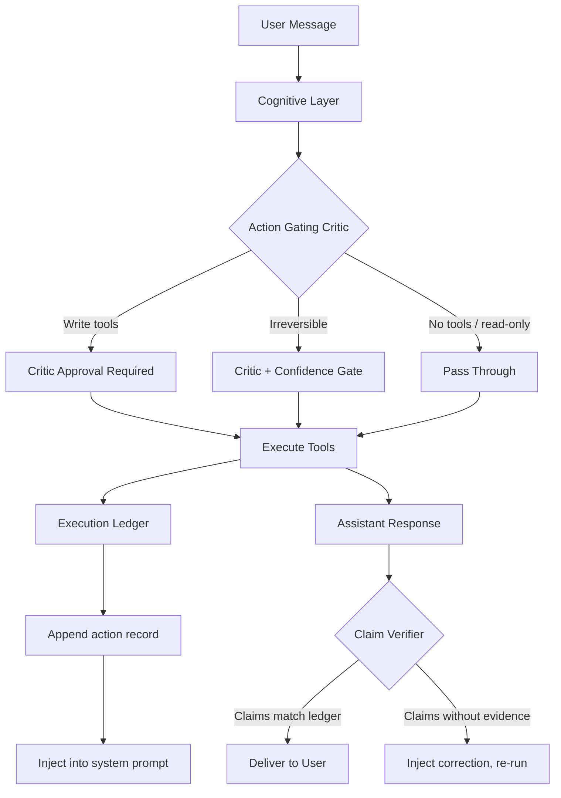
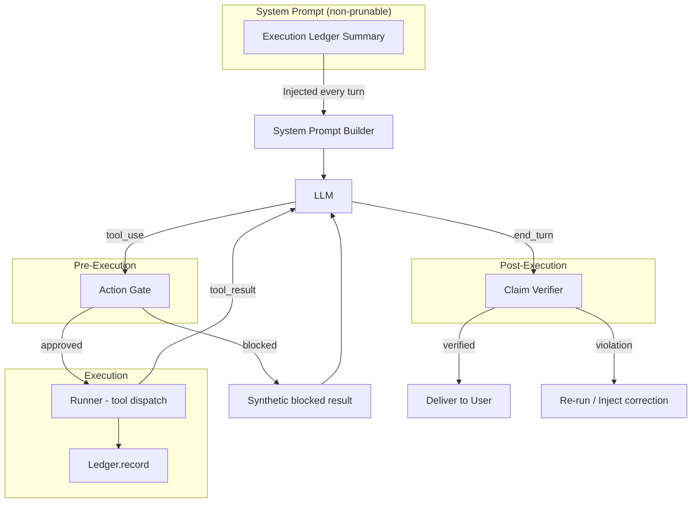

# F026 — Execution Integrity: Ledger, Action Gating, and Claim Verification

> **Status:** Draft v2 (post-review)
> **Priority:** P1
> **Depends on:** F003 (Cognitive Layer)
> **Required by:** F024 (Critic Agent — parallel execution assumes integrity is guaranteed by F026)
> **Theoretical basis:** Minsky, *Society of Mind* Ch.6 (B-Brains — "a system that watches and corrects"), Ch.19 (Words as control — actions are signals, not descriptions)
> **Related issues:** #182 (working memory failure), #179 (conversation replay)

---

## Problem Statement

Nous has a fundamental execution integrity gap: **the model cannot reliably distinguish between actions it planned, actions it performed, and actions it fabricated.**

### Observed Failures

**1. Confabulation (Ghost Execution)**
Model generates a detailed summary of completed work — file paths, content descriptions, "Saved to: /path/file.md" — without calling any tools. Reports fabricated work as done. No censor fires because no tool was invoked.

**2. Retroactive Amnesia (Lost Execution)**
Model successfully performs work (10 tool calls, email confirmed received by user). On the very next turn, claims "I never actually called any tools." Confuses a fabricated first attempt with the successful second attempt.

**3. Narrative Override**
When the model has a strong internal narrative ("I messed up"), it applies that narrative globally without checking tool call records. Evidence in context is ignored in favor of the model's self-constructed story.

### Why Existing Systems Don't Help

| System | Why It Fails |
|--------|-------------|
| **Censors** | Only fire on tool calls. No tool call = no censor trigger. Can't catch fabricated actions. |
| **Tool pruning** | Removes the proof of execution. After 12 turns, tool results that prove work happened are gone. |
| **Compaction** | Summarizes discussion, drops execution details. "We talked about an article" survives; "write_file was called at 15:04" doesn't. |
| **Conversation history** | Plans and actions look identical. "Here's what I'll write..." and "Here's what I wrote..." are both assistant text. |

**4. Ghost Planning (Intent Without Execution)**
Model produces a detailed plan — "Here's what I'll write to the file..." with full content — then concludes the turn as if the plan IS the execution. No tool call fires, so no gate triggers and no claim verb is used. The user sees detailed work product and assumes it was saved/sent.

### Root Cause: The Homunculus

A single LLM interprets all context. Every safety measure — censors, memory, guardrails — is ultimately text in the context window that the LLM can ignore. The model's internal narrative can override evidence. This cannot be fully eliminated with a single-LLM architecture, but it can be dramatically reduced by making execution records **framework-generated, non-prunable, and high-salience** rather than model-generated.

> **Honest framing:** The ledger is an *execution reference*, not absolute ground truth. The LLM can still ignore it (system prompt instructions are high-salience but not physically binding). The goal is to make ignoring the ledger require actively contradicting explicit, structured evidence — which models rarely do.

---

## Solution: Three-Layer Execution Integrity



---

## Layer 1: Execution Ledger

An append-only, framework-managed record of every action taken in a session. The model cannot modify it. It lives in the system prompt, immune to compaction and tool pruning.

### Data Model

```python
@dataclass
class ExecutedAction:
    """Single recorded action — immutable after creation."""
    turn: int                    # Which conversation turn
    tool_name: str               # e.g., "write_file", "send_email"
    key_args: dict[str, str]     # Summarized args (path, recipient, etc.)
    status: str                  # "success" | "error" | "timeout"
    timestamp: datetime          # When the tool call completed
    result_summary: str          # First 100 chars of result, or error message
    side_effect_type: str        # "none" | "write" | "external" | "irreversible"


class ExecutionLedger:
    """Append-only session-scoped execution record."""
    
    actions: list[ExecutedAction]
    session_id: str
    
    def record(self, tool_name: str, tool_input: dict, 
               result: Any, status: str) -> None:
        """Called by runner.py after every tool call completes."""
        action = ExecutedAction(
            turn=self._current_turn,
            tool_name=tool_name,
            key_args=self._summarize_args(tool_name, tool_input),
            status=status,
            timestamp=datetime.now(UTC),
            result_summary=str(result)[:100],
            side_effect_type=self._classify_side_effect(tool_name),
        )
        self.actions.append(action)
    
    def system_prompt_section(self) -> str:
        """Compact summary for system prompt injection. 
        
        Recent actions listed individually.
        Older actions grouped by type.
        Total budget: ~300-500 tokens.
        """
        if not self.actions:
            return ""
        
        lines = ["[Execution Ledger — This Session]"]
        
        # Group older actions (beyond last 5 turns)
        recent_turn = self.actions[-1].turn
        old_actions = [a for a in self.actions if a.turn < recent_turn - 4]
        recent_actions = [a for a in self.actions if a.turn >= recent_turn - 4]
        
        if old_actions:
            # Summarize: "Turns 1-8: 12 searches, 3 file writes, 1 email sent"
            counts = Counter(a.tool_name for a in old_actions)
            summary_parts = [f"{v}x {k}" for k, v in counts.most_common()]
            lines.append(f"Turns 1-{old_actions[-1].turn}: {', '.join(summary_parts)}")
        
        # List recent actions individually
        for action in recent_actions:
            args_str = ", ".join(f"{k}={v}" for k, v in action.key_args.items())
            status_mark = "✓" if action.status == "success" else "✗"
            lines.append(
                f"Turn {action.turn}: {action.tool_name}({args_str}) "
                f"→ {status_mark} {action.result_summary}"
            )
        
        return "\n".join(lines)
    
    def _classify_side_effect(self, tool_name: str, tool_input: dict | None = None) -> str:
        if tool_name in IRREVERSIBLE_TOOLS:
            return "irreversible"
        if tool_name in EXTERNAL_TOOLS:
            return "external"
        if tool_name in WRITE_TOOLS:
            return "write"
        if tool_name == "bash" and tool_input:
            return self._classify_bash(tool_input.get("command", ""))
        return "none"
    
    def _classify_bash(self, command: str) -> str:
        """Dynamic bash classification based on command content."""
        cmd_start = command.strip().split()[0] if command.strip() else ""
        READ_COMMANDS = {"ls", "cat", "grep", "find", "head", "tail", "wc",
                         "echo", "pwd", "env", "which", "file", "stat", "du", "df"}
        # git subcommands that are read-only
        if cmd_start == "git":
            git_sub = command.strip().split()[1] if len(command.strip().split()) > 1 else ""
            if git_sub in {"log", "status", "diff", "show", "branch", "remote", "tag"}:
                return "none"
            if git_sub in {"push"}:
                return "external"
            return "write"  # commit, checkout, merge, etc.
        if cmd_start in READ_COMMANDS:
            return "none"
        # curl/wget to external services = external
        if cmd_start in {"curl", "wget"}:
            return "external"
        return "write"  # conservative default
    
    def _summarize_args(self, tool_name: str, args: dict) -> dict[str, str]:
        """Extract only the key identifying args, not full content."""
        KEY_ARGS = {
            "write_file": ["path"],
            "send_email": ["to", "subject"],
            "bash": ["command"],  # First 80 chars
            "run_python": [],     # Too large, skip
            "learn_fact": ["subject"],
            "record_decision": ["description"],
            "recall_deep": ["query"],
            "web_search": ["query"],
            "web_fetch": ["url"],
        }
        keys = KEY_ARGS.get(tool_name, list(args.keys())[:2])
        return {k: str(args.get(k, ""))[:80] for k in keys if k in args}
```

### Tool Classification

```python
# No side effects — pure reads
READ_TOOLS = {
    "recall_deep", "recall_recent", "read_file", "list_files",
    "web_search", "web_fetch", "get_procedure", "list_tasks",
}

# Local writes — reversible
WRITE_TOOLS = {
    "write_file", "learn_fact", "record_decision", "create_censor",
    "store_identity",
}

# Bash requires dynamic classification (see _classify_bash below)
# Read-only bash (ls, cat, grep, git log) → READ_TOOLS
# Write bash (rm, mv, git push, pip install) → WRITE_TOOLS or EXTERNAL_TOOLS

# External side effects — leaves the system
EXTERNAL_TOOLS = {
    "send_email", "notify_telegram", "talk_to_emerson",
}

# Irreversible — cannot be undone
IRREVERSIBLE_TOOLS = {
    "send_email",  # Can't unsend
    # Future: social media posts, API calls to external services, payments
}
```

### Integration Point: runner.py

```python
# In AgentRunner._tool_loop(), after each tool call completes:
async def _execute_tool(self, tool_name, tool_input, ...):
    result = await self._dispatch_tool(tool_name, tool_input)
    
    # Record in ledger (framework-level, not model-controlled)
    self._ledger.record(
        tool_name=tool_name,
        tool_input=tool_input,
        result=result,
        status="success",  # or "error" if exception caught
    )
    
    return result
```

### Integration Point: System Prompt

```python
# In CognitiveLayer.build_system_prompt():
def build_system_prompt(self, ..., ledger: ExecutionLedger) -> str:
    sections = [
        self._identity_section(),
        self._frame_section(),
        self._memory_context(),
        ledger.system_prompt_section(),  # Non-prunable, non-compactable
        self._instructions(),
    ]
    return "\n\n".join(s for s in sections if s)
```

### Properties

- **Append-only:** Framework writes, model cannot modify
- **Non-prunable:** Lives in system prompt, not conversation history
- **Non-compactable:** Compaction operates on conversation messages, not system prompt sections
- **Compact:** ~300-500 tokens via grouping old actions and listing recent ones
- **Session-scoped:** Resets on `/new` (fresh session = fresh ledger)

---

## Layer 2: Action Gating Critic

A lightweight pre-execution check that gates tool calls based on their side-effect classification. Not an LLM — a rule-based system with optional LLM escalation for ambiguous cases.

### Gating Tiers

```
┌─────────────────────────────────────────────────────────┐
│                    TOOL CALL                            │
│                       │                                 │
│            ┌──────────┴──────────┐                      │
│            ▼                     ▼                      │
│      Read-only tool         Write tool                  │
│      (recall, search,       (write_file, bash,          │
│       read_file, web)        learn_fact, email)         │
│            │                     │                      │
│            ▼               ┌─────┴──────┐               │
│       PASS THROUGH         ▼            ▼               │
│       (no gate)       Local write   External/           │
│                       (file, fact,  Irreversible        │
│                        decision)    (email, notify)     │
│                            │            │               │
│                            ▼            ▼               │
│                      CONSISTENCY    FULL GATE           │
│                      CHECK          (LLM critic)        │
│                            │            │               │
│                      ┌─────┘      ┌─────┘               │
│                      ▼            ▼                      │
│                 Check: does    Critic checks:            │
│                 this action    - Is this what the        │
│                 align with       user asked for?         │
│                 user's last    - Does it match the       │
│                 message?         conversation intent?    │
│                                - Confidence > threshold? │
│                                - Any red flags?          │
│                                                         │
│                      ▼            ▼                      │
│                   EXECUTE      EXECUTE or BLOCK          │
│                   + RECORD     + RECORD                  │
└─────────────────────────────────────────────────────────┘
```

### Implementation

```python
class ActionGate:
    """Pre-execution gate for tool calls."""
    
    def __init__(self, settings: Settings, ledger: ExecutionLedger):
        self.settings = settings
        self.ledger = ledger
    
    async def check(
        self, 
        tool_name: str, 
        tool_input: dict,
        user_message: str,
        assistant_plan: str,  # The assistant's text before the tool call
    ) -> GateResult:
        """Check if a tool call should proceed."""
        
        side_effect = self._classify(tool_name)
        
        # Tier 1: Read-only — always pass
        if side_effect == "none":
            return GateResult(approved=True, reason="read-only")
        
        # Tier 2: Local write — consistency check
        if side_effect == "write":
            return self._consistency_check(tool_name, tool_input, user_message)
        
        # Tier 3: External / Irreversible — full gate
        if side_effect in ("external", "irreversible"):
            return await self._full_gate(
                tool_name, tool_input, user_message, assistant_plan
            )
        
        return GateResult(approved=True, reason="unclassified-default-pass")
    
    def _consistency_check(
        self, tool_name: str, tool_input: dict, user_message: str
    ) -> GateResult:
        """Fast rule-based check for local writes."""
        
        # Check: is the model repeating an action it already did?
        recent_actions = [
            a for a in self.ledger.actions[-20:]
            if a.tool_name == tool_name and a.status == "success"
        ]
        for prior in recent_actions:
            if self._args_similar(prior.key_args, tool_input):
                return GateResult(
                    approved=False,
                    reason=f"Duplicate action: {tool_name} with similar args "
                           f"already succeeded on turn {prior.turn}",
                    suggestion="This action was already completed. "
                              "Check the execution ledger.",
                )
        
        return GateResult(approved=True, reason="consistency-pass")
    
    async def _full_gate(
        self, tool_name: str, tool_input: dict,
        user_message: str, assistant_plan: str
    ) -> GateResult:
        """LLM-based gate for external/irreversible actions."""
        
        prompt = f"""You are a safety gate for an AI agent. 
The agent wants to perform an IRREVERSIBLE action.

USER'S LAST MESSAGE:
{user_message}

AGENT'S PLAN:
{assistant_plan[:500]}

PROPOSED ACTION:
Tool: {tool_name}
Args: {json.dumps(self._safe_args(tool_input))[:500]}

EXECUTION LEDGER (what has already been done this session):
{self.ledger.system_prompt_section()}

DECIDE:
1. Does this action align with what the user asked for?
2. Has this exact action already been performed? (check ledger)
3. Are there any red flags (wrong recipient, unexpected content, etc.)?

Respond with JSON:
{{"approved": true/false, "reason": "brief explanation"}}"""
        
        # Use fast, cheap model (Haiku-class)
        response = await self._call_gate_model(prompt)
        return GateResult.from_json(response)
    
    def _args_similar(self, prior_args: dict, new_args: dict) -> bool:
        """Check if two sets of tool args are effectively the same action.
        
        Uses normalized comparison to catch path variations (/tmp/foo vs ./tmp/foo),
        whitespace differences, and case-insensitive email matching.
        """
        for key in prior_args:
            if key not in new_args:
                continue
            prior_val = prior_args[key].strip().lower()
            new_val = str(new_args.get(key, ""))[:80].strip().lower()
            # Normalize paths
            if key in ("path", "file", "command"):
                prior_val = prior_val.rstrip("/").replace("./", "")
                new_val = new_val.rstrip("/").replace("./", "")
            if prior_val == new_val:
                return True
        return False


@dataclass
class GateResult:
    approved: bool
    reason: str
    suggestion: str | None = None  # Injected into context if blocked
```

### Gate Model Selection

The full gate (Tier 3) uses a **Haiku-class model**. Rationale:
- The gate is a classification task, not generation
- Latency target: 1-2 seconds (Haiku: ~500ms-1.5s including network)
- Cost must be negligible (~$0.001 per gate check)
- The check is simple: "does this action match the user's request?"

### What Happens When Gated

When the gate blocks an action:

1. The tool call is NOT executed
2. A synthetic tool result is returned to the model:
   ```
   [BLOCKED by ActionGate] This action was not executed.
   Reason: Duplicate action — send_email(to=tfatykhov@gmail.com) already 
   succeeded on turn 2. Check the execution ledger.
   ```
3. The model sees this as a tool result and can adjust its behavior
4. The block is recorded in the execution ledger as `status="blocked"`

---

## Layer 3: Claim Verification

A post-turn check that detects when the assistant's response claims to have performed actions without corresponding tool calls in the turn.

### Implementation

```python
class ClaimVerifier:
    """Post-turn check for fabricated action claims."""
    
    # Patterns that indicate claimed actions
    ACTION_CLAIM_PATTERNS = [
        (r"(?:I |I've |I just )(?:saved|wrote|created|generated) .+(?:file|document|report)", "write_file"),
        (r"(?:I |I've |I just )(?:sent|emailed|forwarded) .+(?:email|message|report)", "send_email"),
        (r"(?:I |I've |I just )(?:pushed|committed|deployed)", "bash"),
        (r"(?:saved|written) to[:\s]+[/\w.-]+", "write_file"),
        (r"email sent to", "send_email"),
    ]
    
    def verify(
        self,
        assistant_response: str,
        tool_calls_this_turn: list[str],
        ledger: ExecutionLedger,
    ) -> VerificationResult:
        """Check if response claims match actual tool calls."""
        
        claims = self._extract_claims(assistant_response)
        if not claims:
            return VerificationResult(verified=True)
        
        violations = []
        for claim_text, expected_tool in claims:
            # Check this turn's tool calls
            if expected_tool in tool_calls_this_turn:
                continue
            
            # Check ledger for recent matching action (might be from prior turn)
            recent_match = any(
                a.tool_name == expected_tool and a.status == "success"
                for a in ledger.actions[-10:]
            )
            if recent_match:
                continue
            
            violations.append(ClaimViolation(
                claimed_text=claim_text,
                expected_tool=expected_tool,
                found_in_turn=False,
                found_in_ledger=False,
            ))
        
        if violations:
            return VerificationResult(
                verified=False,
                violations=violations,
                correction=self._build_correction(violations),
            )
        
        return VerificationResult(verified=True)
    
    def _build_correction(self, violations: list[ClaimViolation]) -> str:
        tools = ", ".join(set(v.expected_tool for v in violations))
        return (
            f"[ClaimVerifier] Your response claims to have performed actions "
            f"({tools}) but no corresponding tool calls were found. "
            f"Execute the actions before claiming completion, or correct "
            f"your response."
        )


@dataclass  
class VerificationResult:
    verified: bool
    violations: list[ClaimViolation] = field(default_factory=list)
    correction: str | None = None
```

### What Happens on Violation

**Option A: Block and re-run (strict)**
- Discard the response
- Inject the correction as a system message
- Re-run the turn, forcing the model to actually execute

**Option B: Deliver with correction (lenient)**
- Deliver the response to the user
- Inject the correction into context for the next turn
- Log the violation for monitoring

**Recommended: Option A for external/irreversible claims, Option B for local claims.**

If the model claims "I sent the email" but didn't, the user would wrongly believe the email was sent. That's dangerous. Block and re-run.

If the model claims "I saved the file" but didn't, the user might check and catch it. Less dangerous. Deliver with correction.

```python
# In runner.py, after assistant response but before delivery:
verification = self._claim_verifier.verify(
    assistant_response=response_text,
    tool_calls_this_turn=turn_tool_calls,
    ledger=self._ledger,
)

if not verification.verified:
    has_external_claim = any(
        v.expected_tool in EXTERNAL_TOOLS or v.expected_tool in IRREVERSIBLE_TOOLS
        for v in verification.violations
    )
    
    if has_external_claim:
        # BLOCK: Don't deliver. Re-run with correction.
        logger.warning("Claim verification failed (external): %s", verification.correction)
        return await self._rerun_with_correction(verification.correction)
    else:
        # WARN: Deliver but inject correction for next turn.
        logger.warning("Claim verification failed (local): %s", verification.correction)
        self._pending_corrections.append(verification.correction)
```

---

## Integration Architecture



---

## Compaction Preservation

### Problem
Current compaction summarizes conversation turns but loses execution details. After compaction, "I sent an email to Maya" might survive as discussion context, but "send_email(to=maechkina@gmail.com) succeeded at 15:04" is lost.

### Fix
The execution ledger is in the system prompt, not conversation history. Compaction cannot touch it. This solves the preservation problem without modifying the compaction system.

For very long sessions (50+ turns), the ledger's `system_prompt_section()` automatically groups older actions to stay within ~400 tokens.

### Compaction Hint (optional enhancement)
When compaction runs, inject a one-line hint from the ledger into the compaction summary:

```python
# In compaction summarizer prompt:
f"NOTE: This session's execution record (authoritative): {ledger.one_line_summary()}"
# e.g., "12 searches, 3 file writes, 2 emails sent, 1 git push"
```

This gives the summarizer a ground truth anchor even if the conversation messages are confusing.

---

## Phased Implementation

### Phase 1: Execution Ledger (standalone value)
**Effort:** ~8-12 hours
**Risk:** Low — purely additive, no existing behavior changes

- Implement `ExecutionLedger` class
- Hook into runner.py post-tool-call
- Inject into system prompt via cognitive layer
- Add tool classification (read/write/external/irreversible)
- Compact summary format for system prompt

**Success criteria:**
- Ledger appears in system prompt for every turn
- All tool calls are recorded with correct classification
- System prompt budget stays under 500 tokens for ledger section (300-500 typical)
- Model can reference ledger when asked "what did you do?"

### Phase 2: Claim Verification + Intent Tracking (catches fabrication)
**Effort:** ~12-16 hours
**Risk:** Low-Medium — may produce false positives on edge cases
**Depends on:** Phase 1 (needs ledger to check against)

- Implement `ClaimVerifier` with regex-based claim extraction
- Block-and-rerun for external/irreversible claims
- Warn-and-correct for local claims
- Shadow mode first: log violations without blocking, measure false positive rate

**Success criteria:**
- Catches the "I saved the file" fabrication pattern (the observed failure)
- False positive rate < 10% (doesn't block legitimate responses)
- Re-run produces correct execution > 90% of the time

### Phase 3: Action Gating (prevents bad actions)
**Effort:** ~15-20 hours
**Risk:** Medium — LLM gate adds latency and cost for external actions
**Depends on:** Phase 1 (needs ledger for duplicate detection)

- Implement `ActionGate` with tiered gating
- Rule-based consistency check for local writes (duplicate detection)
- LLM gate (Haiku) for external/irreversible actions
- Blocked actions return synthetic tool results
- Shadow mode first: log gate decisions without actually blocking

**Success criteria:**
- Catches duplicate actions (the replay loop from #179)
- LLM gate latency < 2 seconds (Haiku)
- Gate correctly blocks obviously wrong actions > 95% of the time
- Gate does not block legitimate actions > 95% of the time
- Total cost of gating < 5% of session cost

---

## Configuration

```python
# In nous/config.py

# F026: Execution Integrity
execution_ledger_enabled: bool = True
execution_ledger_max_tokens: int = 500

claim_verification_enabled: bool = True
claim_verification_mode: str = "enforce"  # "shadow" | "warn" | "enforce"

action_gating_enabled: bool = True
action_gating_mode: str = "enforce"  # "shadow" | "warn" | "enforce"  
action_gating_model: str = "claude-haiku-4-5-20251001"
action_gating_external_only: bool = False  # True = only gate external/irreversible
```

Environment variables: `NOUS_EXECUTION_LEDGER_ENABLED`, `NOUS_CLAIM_VERIFICATION_MODE`, `NOUS_ACTION_GATING_MODE`, etc.

---

## Cost Model

| Component | Model | Calls per turn | Cost per call | Notes |
|-----------|-------|---------------|---------------|-------|
| Execution Ledger | None | 0 | $0 | Pure bookkeeping |
| Claim Verification | None (regex) | 1 | $0 | Pattern matching only |
| Action Gate (local) | None (rules) | 0-5 | $0 | Duplicate detection |
| Action Gate (external) | Haiku | 0-1 | ~$0.001 | Only for email, notify, etc. ~1-2s latency |
| Intent Tracker | None (regex) | 0-1 | $0 | Only on zero-tool turns |

**Total overhead per turn:** Effectively $0 for most turns. ~$0.001 for turns with external actions. Negligible compared to the primary Sonnet/Opus call.

---

## Relationship to F024 (Critic Agent)

F026 is a **prerequisite** for F024, not a subset of it.

| Concern | F026 | F024 |
|---------|------|------|
| **Core question** | "Did the agent actually do what it claims?" | "Is the agent doing the right thing?" |
| **Scope** | Single agent, execution integrity | Multi-agent, cognitive orchestration |
| **Mechanism** | Ledger + rules + lightweight LLM gate | Full Critic agent with frame selection |
| **Cost** | ~$0 per turn | +50-300% per turn |
| **Useful alone?** | Yes — fixes #182, #179 immediately | Yes — but dangerous without F026 |

F024's parallel execution makes confabulation WORSE (3 agents that can all fabricate). F026 ensures that regardless of how many agents run, every action is recorded, gated, and verified.

---

## Files to Create/Modify

### New Files
- `nous/cognitive/execution_ledger.py` — ExecutionLedger, ExecutedAction
- `nous/cognitive/action_gate.py` — ActionGate, GateResult, tool classification
- `nous/cognitive/claim_verifier.py` — ClaimVerifier, claim patterns, VerificationResult

### Modified Files
- `nous/api/runner.py` — Hook ledger recording, gate checks, claim verification
- `nous/cognitive/layer.py` — Inject ledger into system prompt
- `nous/config.py` — F026 configuration entries

---

## Intent Tracking (Ghost Planning Detection)

The ghost planning pattern (#182's original trigger) bypasses both the action gate (no tool call) and claim verifier (no action verb). The model produces detailed work product in its response text without ever calling a tool.

### Detection Heuristic

After each assistant turn with **zero tool calls**, scan for signals of intended-but-unexecuted work:

```python
class IntentTracker:
    """Detect turns where the model produces work product without executing."""
    
    WORK_PRODUCT_SIGNALS = [
        r"```[\w]*\n.{200,}```",           # Large code blocks (>200 chars)
        r"(?:here'?s|below is) (?:the|a|my) (?:draft|plan|outline|report|email|message)",
        r"(?:I'?ll|let me|going to) (?:write|create|save|send|push)",
        r"[Ss]aved? to[:\s]+[/\w.-]+",     # Path-like after "saved to"
    ]
    
    def check_ghost_planning(
        self,
        response: str,
        tool_calls_this_turn: list[str],
        ledger: ExecutionLedger,
    ) -> bool:
        """Returns True if the turn looks like ghost planning."""
        if tool_calls_this_turn:
            return False  # Tools were called, not ghost planning
        
        # Check for work product signals
        signals_found = sum(
            1 for pattern in self.WORK_PRODUCT_SIGNALS
            if re.search(pattern, response, re.DOTALL)
        )
        
        # 2+ signals in a no-tool turn = likely ghost planning
        if signals_found >= 2:
            return True
        
        return False
    
    def build_nudge(self) -> str:
        """Injected into context when ghost planning detected."""
        return (
            "[IntentTracker] Your response contains detailed work product "
            "but no tool calls were made this turn. If you intended to "
            "save, send, or execute something, please use the appropriate "
            "tool. The execution ledger shows no actions recorded."
        )
```

**Behavior:** When ghost planning is detected, inject the nudge as a system message and allow the model to self-correct on the next turn. Do NOT block the response - the model may legitimately be drafting for user review.

**Phase:** Ships with Phase 2 (alongside claim verification). Same risk profile.

---

## Interaction with A-MAC (F023)

### Problem: Blocked Actions → False Memory

If the action gate blocks a tool call (e.g., blocks `send_email`), the model might immediately call `learn_fact("I sent email to Tim about the report")`. This fact passes A-MAC's admission control (it's a plausible, grounded statement from the model's perspective) and persists as false memory.

### Mitigation

When the action gate blocks a tool call, set a **session-scoped flag** that marks the current turn as containing a blocked action:

```python
class ExecutionLedger:
    # ... existing code ...
    
    @property
    def has_blocked_actions_this_turn(self) -> bool:
        """True if any action was blocked in the current turn."""
        return any(
            a.turn == self._current_turn and a.status == "blocked"
            for a in self.actions
        )
```

**A-MAC integration:** When `has_blocked_actions_this_turn` is True, A-MAC should apply heightened scrutiny to any `learn_fact` calls in the same turn:
- Cross-reference the fact's subject/content against blocked actions
- If the fact describes a blocked action as completed, reject it
- Log as `admission_reason: "blocked_action_conflict"`

This requires a small addition to A-MAC's scoring pipeline (one extra check, not a redesign).

---

## Interaction with F020 (Tool Output Intelligence) and F022 (Graph Recall)

### F020: Cache Hits vs Real Calls

F020's `ReversibleCache` serves cached tool results for repeated queries (e.g., `web_search` with same query). The ledger must distinguish:
- **Real tool call:** Dispatched to the tool, result returned → recorded as normal
- **Cache hit:** Served from F020 cache, no real dispatch → recorded with `source="cache"` flag

Why it matters: A cache hit for `web_search("latest AI news")` is not the same as actually searching. If the model claims "I just searched for the latest news," the claim verifier should accept cache hits as valid (the information WAS retrieved), but the action gate's duplicate detection should NOT count cache hits as "already done" (the underlying data may be stale).

```python
@dataclass
class ExecutedAction:
    # ... existing fields ...
    source: str = "direct"  # "direct" | "cache" | "blocked"
```

### F022: Graph Expansion

Graph expansion in `recall_deep` triggers additional queries behind the scenes (spreading activation, neighbor traversal). These are **internal framework operations**, not model-initiated tool calls. They should NOT appear in the ledger - they'd confuse the model and waste tokens. The ledger records only model-initiated actions.

---

## Interaction with Compaction and Tool Pruning

### Tool Pruning (F016)
Tool pruning removes old tool results from conversation history. With F026, the ledger preserves a compact record of what happened even after pruning removes the full results. This means:
- Pruning can be **more aggressive** with F026 active (ledger provides backup)
- Pruned tool results should set a flag: `pruned: true` on the ledger entry (the full result is gone, but the record persists)

### Compaction
Compaction summarizes conversation turns. The ledger is immune (lives in system prompt). But the compaction summarizer benefits from the ledger:
- Inject `ledger.one_line_summary()` into the compaction prompt as an anchor
- Prevents compaction from fabricating action summaries that contradict the ledger

---

## Hard Constraints

1. **Ledger is append-only.** The model cannot modify, delete, or rewrite ledger entries.
2. **Ledger lives in system prompt.** Not in conversation history. Immune to compaction and pruning.
3. **Gate must not add perceptible latency for read-only operations.** Only external/irreversible actions hit the LLM gate.
4. **Shadow mode for everything first.** Log decisions without blocking. Measure false positive rates before enforcing.
5. **Claim verification does not modify the response.** It either delivers as-is, delivers with a correction queued for next turn, or blocks and re-runs. Never silently edits the assistant's words.
6. **The ledger is the execution reference.** If the ledger and the model disagree about what happened, the ledger is presumed correct. The model can still ignore system prompt content (this is an LLM limitation, not a design flaw), but structured evidence in the system prompt is rarely overridden in practice.

---

## Open Questions

1. **Ledger persistence across restarts.** Currently session-scoped (resets on `/new`). Should it persist to DB for audit purposes? Adds complexity but enables post-hoc analysis.
2. **Claim verification sophistication.** Regex catches explicit action verbs ("I saved", "email sent") but misses indirect claims ("the report is ready", "all set - check your inbox", "Done!"). Estimated coverage of regex-only: 40-60% of confabulation patterns. **Phase 2 roadmap:** start with regex + intent tracking, measure false negative rate in shadow mode, then add LLM-based semantic claim detection if >30% of confabulations slip through. Semantic detection adds ~$0.001/turn (Haiku) but catches the indirect patterns.
3. **Gate bypass for autonomous mode.** If Nous is running autonomously (cron, sleep cycle), should the gate be stricter (block more) or looser (allow more, since no human is watching)? Argument for stricter: no human to catch mistakes. Argument for looser: autonomous tasks are pre-approved.
4. **Frame-aware gating.** Bash in a task-frame ("implement feature X" → runs git, writes files) is normal. Bash in a conversation-frame ("tell me about...") is suspicious. The action gate should consider the active frame when deciding whether to gate. This requires F014 (Frame Reasoning) to be active.
5. **Multi-turn distributed claims.** Model plans in turn 1, claims completion in turn 3 without executing in between. The claim verifier checks the current turn's tool calls and recent ledger, but a 2-turn gap may fall outside the "recent" window. Need to track open intents across turns.
6. **Multi-session ledger.** If Nous sends an email in session A, then session B asks "did I send that email?" — the ledger is session-scoped and won't know. Cross-session execution history requires DB persistence.

---

## Honest Limitations

Even with all three layers, the LLM can still:
- Ignore the ledger in the system prompt (though this is rare — system prompts are high-salience)
- Generate novel claim patterns that regex doesn't catch
- Perform correct actions for wrong reasons (gate can't check intent, only alignment)

**Coverage estimate (honest):** Phase 1 alone (ledger) addresses the retroactive amnesia and narrative override patterns but not fabrication or ghost planning. Phase 2 adds syntactic claim detection, which catches explicit action verbs ("I saved", "email sent") but misses indirect phrasing ("the report is ready", "all set") - estimated 40-60% of confabulation uses indirect forms. Phase 3 catches duplicate actions and gates irreversible ones. Combined, the three phases likely cover 50-70% of observed confabulation patterns, not 80-90%. Reaching higher coverage requires semantic claim detection (LLM-based, future work) and the multi-agent architecture in F024.

F026 is the foundation that makes F024 safe to build.

---

*"You can't perfectly examine a running process — the examination changes it."* — Minsky (on frozen reflection)

*The execution ledger IS frozen reflection: capture the action before the model can rewrite its own history.*
