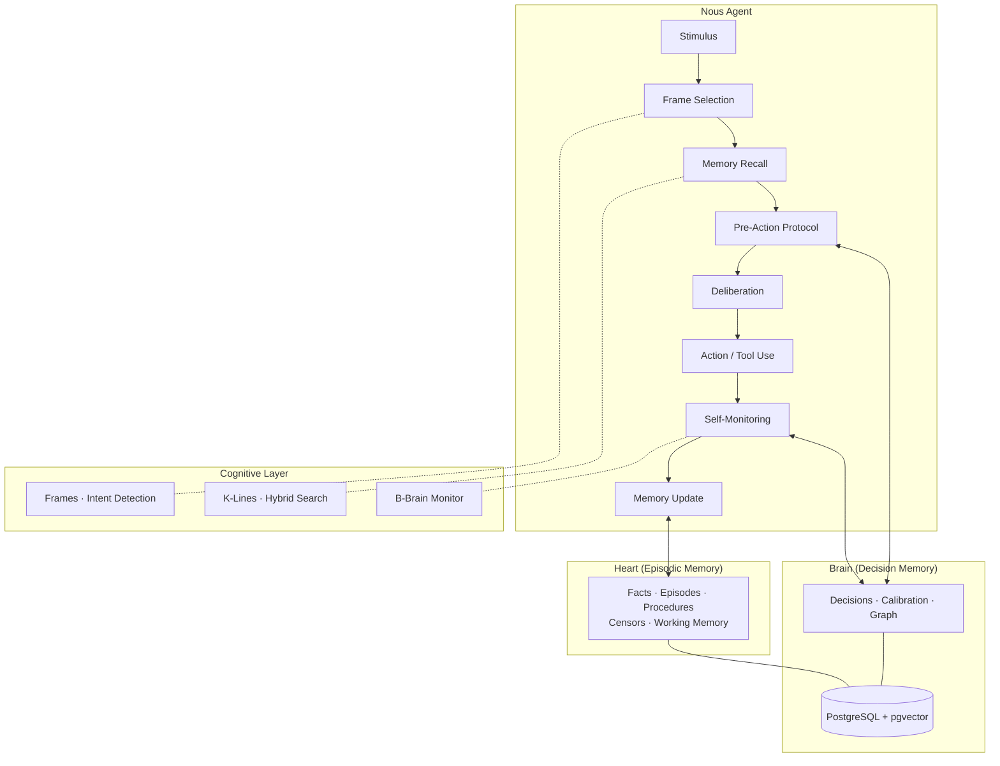

<p align="center">
  
</p>

# Nous

**A cognitive architecture for AI agents, grounded in Minsky's Society of Mind.**

Nous is a framework for building AI agents that think, learn, and grow — not just respond. It applies the decision intelligence principles proven by [Cognition Engines](https://github.com/tfatykhov/cognition-agent-decisions), and implements Marvin Minsky's Society of Mind principles as first-class architectural components.

> *"To explain the mind, we have to show how minds are built from mindless stuff."* — Marvin Minsky

**[Quickstart Guide →](docs/quickstart.md)** — Deploy Nous from scratch in minutes.

---

## Why Nous?

Current AI agents are stateless reactors. They receive a prompt, generate a response, and forget. Even agents with "memory" just store and retrieve text — there's no structure, no learning, no growth.

Nous is different. It gives agents:

- **Structured memory** that mirrors how minds actually work — decisions, facts, episodes, procedures, working memory — each with its own lifecycle
- **Decision intelligence** that records every choice with reasoning, tracks outcomes, and calibrates confidence over time
- **Self-monitoring** that catches mistakes, reviews past decisions, and learns from failures
- **Skill-based growth** — agents acquire, register, and auto-discover new capabilities as SKILL.md procedures
- **Autonomous task execution** — subtask spawning, scheduled tasks, and a parallel worker pool for true multi-agent coordination

---

## Architecture Overview

```
Stimulus → Frame Selection → Memory Recall → Deliberation → Action → Monitor → Learn
```



---

## The Nous Loop

Every agent action follows this cycle:

### 1. FRAME — Cognitive Frame Selection
Pattern-matches input against frame definitions (<10ms, no LLM). Selects one of: `conversation`, `question`, `task`, `debug`, `decision`, `creative`, `initiation`. Frame determines which tools are available (frame-gated tool access) and how context is assembled.

**Minsky insight:** You can only hold one frame at a time (Necker cube). Frame-switching is explicit, not automatic.

### 2. RECALL — Hybrid Memory Search
Activates relevant K-lines using hybrid search across all memory types simultaneously. Combines:
- **Vector similarity** (pgvector cosine distance) for semantic matching
- **Full-text search** (Postgres tsvector) for keyword precision
- **Graph-augmented recall** — spreads activation across linked memory nodes
- **Staleness penalties** — time-decays older memories
- **Relevance floor + diminishing returns cutoff** — stops retrieval when signal drops

### 3. DELIBERATE — Pre-Action Protocol
Before acting, Nous queries decision memory, checks guardrails, and records deliberation intent. Extended thinking blocks are captured as deliberation traces.

### 4. ACT — Tool Execution
Direct Anthropic API integration with tool loop. Streaming with keepalive. Context compaction triggers when token budget is exceeded.

### 5. MONITOR — Self-Assessment
The B-Brain monitor watches for: tool call anomalies, decision quality issues, stuck loops, and session timeouts. Triggers procedure learning on real-time recovery.

### 6. LEARN — Memory Update
Async event bus fires handlers: episode summarizer, fact extractor, knowledge extractor, decision reviewer. Sleep cycles run K-line consolidation and procedure auto-learning.

---

## Memory Architecture

Nous implements five memory types across two organs (Brain + Heart):

```
SLOW (Identity)
  └── AgentIdentity — character, values, protocols, preferences, boundaries

MEDIUM (Knowledge)
  ├── Facts — learned beliefs with confidence, tags, source attribution
  ├── Procedures / K-Lines — how to do things; auto-learned from patterns
  └── Episodes — multi-session project memory with summaries and lessons

FAST (Working)
  └── WorkingMemory — current task, frame, relevant context for this turn

PERSISTENT (Intelligence)
  ├── Decisions — every choice with reasoning, confidence, stakes, outcome
  └── Calibration — confidence vs outcome accuracy (Brier scores)
```

**Graph links** connect nodes across memory types via `brain.graph_edges`. Cross-type linking auto-fires when a new fact/episode/decision is stored and finds semantically similar nodes in other types (F022).

---

## Core Components

### Brain
Decision intelligence organ. Backed by `brain` Postgres schema.

- **Record decisions** with category, stakes (low/medium/high/critical), confidence (0–1), multi-type reasoning chains, and optional pattern tagging
- **Quality scoring** — rejects low-signal decisions at record time
- **Calibration engine** — Brier scores, directional accuracy, per-category and per-reason-type breakdown
- **Decision reviewer** — periodic async sweep that reviews unresolved decisions and updates outcomes
- **Graph edges** — stores semantic links between all memory nodes (decisions, facts, episodes, procedures)
- **Spreading activation** — multi-hop graph traversal via recursive CTE when graph density exceeds threshold
- **Cross-type linking** — common-template re-embedding for fair cross-type similarity (F022)
- **Contradiction detection** — flags conflicting facts via embedding similarity + LLM verification (F022)

### Heart
Episodic memory organ. Backed by `heart` Postgres schema.

- **Facts** — store structured beliefs with category, subject, confidence, source attribution, and optional decision/episode linkage
- **Episodes** — multi-turn project memory; summarized by async handler after session end
- **Procedures** — K-lines stored as full SKILL.md with domain, goals, core patterns, core tools, core concepts, and implementation notes
- **Censors** — guardrails with warn/block/absolute actions; pattern-matched against every tool call
- **Working memory** — per-session scratchpad: current task, frame, tags, and linked context
- **Schedules** — cron-like task scheduling with model/frame assignment
- **Subtasks** — async task queue with delivery tracking, frame type, priority, and timeout

### Cognitive Layer
Orchestrates the Nous Loop. Manages:
- **Frame engine** — no-LLM pattern matching, priority tiebreaking
- **Intent detection** — informational vs action-oriented requests; topic persistence
- **Context assembly** — tiered context builder with per-frame token budgets; identity always-on; knowledge injected by relevance
- **Deduplication** — suppresses memories already visible in conversation window
- **Usage tracker** — tracks token spend per section for budget enforcement
- **Monitor** — B-Brain watcher; triggers corrective actions on anomaly detection

### Skills (Procedures)
SKILL.md files are the primary unit of agent capability growth.

**Registration:**
- `learn_skill` tool: accepts URL, local file path, or inline markdown
- `bootstrap_local_skills`: scans `{workspace}/skills/*/SKILL.md` at startup
- `reactivate_skills`: re-checks inactive skills at startup (env var satisfaction)

**Parser (lenient):**
- Strict frontmatter (--- ... ---) with fallback to:
  - Leading whitespace stripping
  - Fenced ```yaml blocks
  - Missing closing `---`
- Required fields: `name` (string), `description` (string)
- Optional: `domain`, `triggers`, `frames`, `tools`, `requires`, `version`, `source_url`
- Auto-correction warnings surfaced in `learn_skill` response

**Deduplication:** exact name match at registration time — no duplicate skills.

**Env var gating:** skills with `requires: [ENV_VAR]` in frontmatter are stored as inactive until the variable exists at startup.

**get_procedure tool:** fetch full skill body by UUID — resolves partial UUID gap in memory recall.

**Auto-discovery (EvoSkill):** The `evoskill` skill runs an automated skill discovery loop using subtask spawning — Executor × 3 parallel → Proposer → Skill-Builder → main Nous registers result.

### Compaction (Context Management)
Three-layer context management system:

**Layer 0 — SmartCompress (F020)**
Ingestion-time compression of tool output before it enters context. Content-type classification (dict arrays, string arrays, log format, raw text). Preserves errors, outliers, high-score items. Adaptive K selection via elbow detection.

**Layer 1 — Tool Pruning (F016)**
4-tier age-based decay applied per tool result:
1. Full content (recent)
2. Soft-trim: head + tail preservation (configurable char limits)
3. Metadata degrade: content cleared, metadata retained
4. Hard clear: full replacement with re-fetchable marker

Pre-prune fact extraction rescues signal before hard-clear. Content-type-aware decay profiles adjust timing per result type.

**Layer 2 — History Compaction (F016 Phase 2)**
LLM-powered conversation summarization when token count exceeds threshold. Produces structured checkpoint (Goal / Constraints / Progress / Key Decisions / Next Steps / Critical Context). Auto-scales threshold to model context window.

### MCP Server
Exposes Nous to other agents via Model Context Protocol at `/mcp`:
- `nous_chat` — send a message, get a response
- `nous_recall` — search across all memory types
- `nous_status` — agent status + calibration report
- `nous_teach` — add a fact or procedure to memory
- `nous_decide` — force a decision frame turn

Race condition fix: `await connect()` before handling first request.

### Subtasks & Scheduling
- `spawn_task` — fire-and-forget or `await_result=true` inline execution
- `schedule_task` — one-shot or recurring (`when` / `every`)
- `list_tasks`, `cancel_task` — lifecycle management
- `SubtaskWorkerPool` — configurable concurrency (default: 3), poll interval, per-task timeout
- `TaskScheduler` — cron-style execution with model and frame type assignment
- `run_python` — sandboxed Python with memory functions in scope (recall_deep, recall_recent, learn_fact, list_tasks)

### Agent Identity
DB-backed identity with versioning (F018):
- Sections: `character`, `values`, `protocols`, `preferences`, `boundaries`
- `store_identity` / `complete_initiation` tools (gated to `initiation` frame)
- Auto-seed from existing facts on first run
- REST API: `GET /identity`, `PUT /identity/{section}`, `POST /reinitiate`

---

## Minsky Concepts — Implementation Status

| Concept | Chapter | Nous Implementation | Status |
|---------|---------|----------------------|--------|
| K-Lines | Ch 8 | Procedures with level-bands; auto-learned from decision clusters and episode lessons | ✅ Shipped |
| Censors | Ch 9 | Guardrails (warn/block/absolute) on every tool call | ✅ Shipped |
| Papert's Principle | Ch 10 | Administrative growth via skills, not model changes | ✅ Shipped |
| Frames | Ch 25 | Pattern-matched, one active frame at a time; explicit switching | ✅ Shipped |
| B-Brains | Ch 6 | Session monitor watches the agent; real-time recovery pathway | ✅ Shipped |
| Parallel Bundles | Ch 18 | Multi-type reasoning chains on every decision | ✅ Shipped |
| Spreading Activation | Ch — | Multi-hop graph traversal via recursive CTE (F022 Phase 4) | ✅ Shipped |
| Polynemes | Ch 19 | Tags as cross-agency activation signals | 🔄 Planned |
| Nemes | Ch 20 | Bridge definitions in memory nodes | 🔄 Planned |
| Pronomes | Ch 21 | Assignment/action separation | 🔄 Planned |

---

## REST API

23 endpoints across Brain, Heart, Identity, Tasks, and Health:

```
POST   /chat                         — Send a message (blocking)
POST   /chat/stream                  — Send a message (SSE stream)
DELETE /chat/{session_id}            — End session

GET    /decisions                    — List decisions
GET    /decisions/unreviewed         — List unreviewed decisions
GET    /decisions/{id}               — Get decision detail
POST   /decisions/{id}/review        — Record decision outcome

GET    /episodes                     — List episodes
GET    /facts                        — Search facts
GET    /censors                      — List censors
GET    /frames                       — List frames
GET    /calibration                  — Calibration report (Brier score, accuracy)

GET    /identity                     — Get full identity
PUT    /identity/{section}           — Update identity section
POST   /reinitiate                   — Re-run initiation protocol

GET    /subtasks                     — List subtasks
GET    /subtasks/{id}                — Get subtask detail
DELETE /subtasks/{id}                — Cancel subtask

GET    /schedules                    — List schedules
POST   /schedules                    — Create schedule
DELETE /schedules/{id}               — Deactivate schedule

GET    /status                       — Agent status
GET    /health                       — Health check

/mcp/*                               — MCP server (StreamableHTTP)
```

---

## Configuration

All settings use `NOUS_` prefix via pydantic-settings. DB connection fields use unprefixed aliases to match docker-compose.

### Core

| Variable | Default | Description |
|----------|---------|-------------|
| `NOUS_MODEL` | `claude-sonnet-4-5-20250514` | Main agent LLM |
| `NOUS_BACKGROUND_MODEL` | `claude-sonnet-4-5-20250514` | Background handler LLM (episode summarizer, etc.) |
| `NOUS_MAX_TURNS` | `10` | Max tool-use iterations per turn |
| `NOUS_THINKING_MODE` | `off` | Extended thinking: `off`, `adaptive`, `manual` |
| `NOUS_EFFORT` | `high` | Adaptive thinking depth: `low`, `medium`, `high`, `max` |
| `NOUS_WORKSPACE_DIR` | `/tmp/nous-workspace` | Agent workspace (skills scanned here at startup) |
| `NOUS_AGENT_ID` | `nous-default` | Unique agent identifier |
| `NOUS_IDENTITY_PROMPT` | built-in | System prompt prefix injected every turn |

### API Keys

| Variable | Description |
|----------|-------------|
| `ANTHROPIC_API_KEY` | Anthropic API key |
| `ANTHROPIC_AUTH_TOKEN` | Bearer token (takes precedence over API key) |
| `OPENAI_API_KEY` | OpenAI key for embeddings (optional — disables vector search if absent) |
| `BRAVE_SEARCH_API_KEY` | Brave Search for `web_search` tool |

### Memory & Recall

| Variable | Default | Description |
|----------|---------|-------------|
| `NOUS_RELEVANCE_FLOOR_ENABLED` | `true` | Per-type minimum score filtering |
| `NOUS_RELEVANCE_DROP_RATIO` | `0.6` | Diminishing returns cutoff |
| `NOUS_BUDGET_SCALE_ENABLED` | `true` | Scale context budgets per model window |
| `NOUS_STALENESS_PENALTY_ENABLED` | `true` | Time-decay memory scores |
| `NOUS_STALENESS_HALF_LIFE_DAYS` | `14` | Half-life for staleness decay |
| `NOUS_CONTEXT_BUDGET_OVERRIDES` | `{}` | JSON dict overriding per-frame budgets |
| `NOUS_GRAPH_RECALL_ENABLED` | `true` | Graph-augmented recall (F022) |
| `NOUS_SPREADING_ACTIVATION_ENABLED` | `auto` | `auto`, `true`, or `false` |

### Context Compaction

| Variable | Default | Description |
|----------|---------|-------------|
| `NOUS_TOOL_PRUNING_ENABLED` | `true` | 4-tier tool result pruning |
| `NOUS_TOOL_SOFT_TRIM_CHARS` | `4000` | Soft-trim trigger size |
| `NOUS_TOOL_SOFT_TRIM_HEAD` | `1500` | Chars kept from head |
| `NOUS_TOOL_SOFT_TRIM_TAIL` | `1500` | Chars kept from tail |
| `NOUS_TOOL_METADATA_DEGRADE_AFTER` | `8` | Age before metadata degradation |
| `NOUS_TOOL_HARD_CLEAR_AFTER` | `12` | Age before hard-clear |
| `NOUS_KEEP_LAST_TOOL_RESULTS` | `2` | Recent results always protected |
| `NOUS_COMPACTION_ENABLED` | `true` | LLM history compaction |
| `NOUS_COMPACTION_THRESHOLD` | auto | Token count trigger (auto-scales to model) |
| `NOUS_KEEP_RECENT_TOKENS` | auto | Tokens preserved during compaction |

### Subtasks & Scheduling

| Variable | Default | Description |
|----------|---------|-------------|
| `NOUS_SUBTASK_ENABLED` | `true` | Enable subtask spawning |
| `NOUS_SUBTASK_WORKERS` | `2` | Worker thread count |
| `NOUS_SUBTASK_MAX_CONCURRENT` | `3` | Max parallel subtasks |
| `NOUS_SUBTASK_DEFAULT_TIMEOUT` | `120` | Default subtask timeout (seconds) |
| `NOUS_SUBTASK_MAX_TIMEOUT` | `600` | Hard cap on subtask timeout |
| `NOUS_SCHEDULE_ENABLED` | `true` | Enable scheduled tasks |
| `NOUS_SCHEDULE_CHECK_INTERVAL` | `60` | Scheduler poll interval (seconds) |

### Event Bus & Handlers

| Variable | Default | Description |
|----------|---------|-------------|
| `NOUS_EVENT_BUS_ENABLED` | `true` | Enable async event bus |
| `NOUS_EPISODE_SUMMARY_ENABLED` | `true` | Auto-summarize completed episodes |
| `NOUS_FACT_EXTRACTION_ENABLED` | `true` | Extract facts from conversations |
| `NOUS_SLEEP_ENABLED` | `true` | Enable sleep consolidation cycles |
| `NOUS_DECISION_REVIEW_ENABLED` | `true` | Periodic decision outcome review |
| `NOUS_DECISION_SWEEP_INTERVAL` | `3600` | Seconds between review sweeps |
| `NOUS_SESSION_TIMEOUT` | `1800` | Session idle timeout (seconds) |
| `NOUS_SLEEP_TIMEOUT` | `7200` | Seconds idle before sleep cycle fires |

### Procedure Learning (K-Lines, F012)

| Variable | Default | Description |
|----------|---------|-------------|
| `NOUS_PROCEDURE_LEARNING_ENABLED` | `true` | Auto-learn procedures from patterns |
| `NOUS_PROCEDURE_CLUSTER_MIN_SIZE` | `3` | Min decisions per cluster |
| `NOUS_PROCEDURE_SIMILARITY_THRESHOLD` | `0.85` | Embedding sim for clustering |
| `NOUS_PROCEDURE_SUCCESS_RATE_MIN` | `0.70` | Min success rate to form procedure |
| `NOUS_PROCEDURE_MAX_PER_SLEEP` | `3` | Procedures created per sleep cycle |

### Integrations

| Variable | Description |
|----------|-------------|
| `TELEGRAM_BOT_TOKEN` | Telegram Bot API token |
| `TELEGRAM_CHAT_ID` | Default Telegram chat ID for notifications |
| `GITHUB_TOKEN` | GitHub token (used by skills) |

---

## Database Schema

23 Postgres tables across 3 schemas:

**`nous_system` (4 tables)**
- `agents` — registered agent instances
- `agent_identity` — versioned identity sections (character, values, protocols, preferences, boundaries)
- `frames` — cognitive frame definitions with activation patterns
- `events` — raw event log (all bus events persisted)

**`brain` (8 tables)**
- `decisions` — decision records with embedding, quality score, outcome
- `decision_tags` — M2M tag associations
- `decision_reasons` — multi-type reasoning chains
- `decision_bridges` — bridge definition extensions
- `graph_edges` — semantic links between any two memory nodes (polymorphic)
- `schema_migrations` — applied migration tracking

**`heart` (11 tables)**
- `facts` — structured beliefs with confidence and source
- `episodes` — multi-session project memory
- `procedures` — K-lines / SKILL.md storage with embedding
- `censors` — guardrail rules
- `working_memory` — per-session scratchpad
- `schedules` — recurring and one-shot task definitions
- `subtasks` — async task queue with delivery tracking
- `tool_cache` — SmartCompress result cache (session-scoped)

**Migrations** applied at startup via `nous_system.schema_migrations`. SQL files in `sql/migrations/`.

---

## Skills System

Skills are SKILL.md files stored as procedures in Heart. They auto-activate during `recall_deep` when semantically relevant to the current task.

### Built-in Skills (39 registered)

**Cognitive & Self-Management**
- `self-improvement-loop` — scores own performance, triggers corrective actions
- `memory-rl-policy` — RL policy for memory operations (ADD/UPDATE/DELETE/NOOP)
- `evoskill` — automated skill discovery via subtask-based Executor/Proposer/Skill-Builder loop
- `brainstorming` — structured creative exploration before implementation
- `writing-plans` — specs before multi-step coding tasks
- `hypothesis-generation` — testable hypotheses from observations

**Document Handling**
- `pdf`, `docx`, `pptx`, `xlsx` — create, read, edit office documents
- `doc-coauthoring` — structured co-authoring workflow
- `internal-comms` — status reports, newsletters, incident reports

**AI & Agent Architecture**
- `multi-agent-patterns` — supervisor, swarm, parallel coordination
- `bdi-mental-states` — Belief-Desire-Intention modeling
- `context-fundamentals`, `context-degradation`, `context-optimization`, `context-compression`
- `tool-design`, `mcp-builder`

**Evaluation & Testing**
- `evaluation`, `advanced-evaluation`, `webapp-testing`

**Development**
- `claude-api`, `cloudflare`, `supabase-postgres-best-practices`
- `variant-analysis`, `code-review`, `d3-viz`, `frontend-slides`

**Utilities**
- `writing-skills` — create and validate SKILL.md files
- `Send Email via Gmail SMTP`, `serper`, `summarize`, `replicate`
- `search-persistence-protocol` — multi-source synthesis with 4-condition stop rule (auto-discovered via EvoSkill)

### Adding Skills

```bash
# From URL
learn_skill(source="https://example.com/SKILL.md")

# From local file
learn_skill(source="skills/my-skill/SKILL.md")

# Inline markdown
learn_skill(source="inline", content="---\nname: my-skill\n...")
```

Skills in `{workspace}/skills/*/SKILL.md` are bootstrapped at startup. Skills requiring env vars are stored inactive and reactivated when vars appear.

---

## Confidence & Calibration

Every decision records a confidence score (0.0–1.0). The calibration engine computes:

- **Brier Score** = mean((confidence − outcome_binary)²) — lower is better
- **Directional Accuracy** — % of decisions where confidence direction matched outcome
- **Per-category breakdown** — separate metrics for architecture/process/tooling/security/integration
- **Per-reason-type breakdown** — which reasoning types (analysis/empirical/pattern/etc.) are most reliable

**Fredkin's Paradox:** When two options look equally good, the choice matters least. At 0.50 confidence, stop deliberating — pick one and move. Save effort for decisions where options are actually different.

---

## Security — Prompt Injection Defense

Based on OpenAI's source-sink model (March 2026):

- **Source-sink analysis**: external content (web_fetch, email) + dangerous capability (learn_fact, send_email, bash) = attack surface
- **Censor on web→memory writes**: warns before web-fetched content triggers `learn_fact` or outbound email without explicit user instruction
- **Credential storage block**: absolute censor on storing API keys, tokens, passwords as facts
- **Confirmation gates**: `evoskill` requires confirmation before `learn_skill`; email censor limits volume and blocks sensitive data

The key principle: **Tim instructs → Nous acts** is safe. **Webpage instructs → Nous acts silently** is the attack surface.

---

## Sleep Consolidation

5-phase biological sleep cycle triggered after `NOUS_SLEEP_TIMEOUT` seconds of idle:

1. **Decay** — apply staleness penalties to aged memories
2. **Consolidation** — strengthen frequently accessed, high-confidence facts
3. **Pattern extraction** — cluster similar decisions into K-lines (ProcedureLearner)
4. **Optimization** — prune weak/stale procedures below success rate threshold
5. **Integrity** — cross-check contradictions, remove orphans

**ProcedureLearner (F012)** runs pathways:
1. Decision clustering — groups similar successful decisions into reusable procedures
2. Episode lesson learning — clusters `lessons_learned` from completed episodes
3. Weak procedure review — revise or retire underperforming auto-learned procedures
4. Real-time recovery — wired into session monitor for pathway 3

---

## Growth Model

Nous agents grow through **Papert's Principle**: the most crucial steps in mental growth are about acquiring new administrative ways to use what one already knows.

| Level | Capability | Status |
|-------|-----------|--------|
| 1 | React to input | ✅ Shipped |
| 2 | Remember past actions | ✅ Shipped |
| 3 | Learn from outcomes | ✅ Shipped |
| 4 | Monitor own thinking | ✅ Shipped (B-Brain monitor) |
| 5 | Improve own processes | ✅ Shipped (EvoSkill + ProcedureLearner) |

---

## Deployment

```bash
# Clone
git clone https://github.com/tfatykhov/nous

# Configure
cp .env.example .env
# Edit .env: ANTHROPIC_API_KEY, OPENAI_API_KEY, BRAVE_SEARCH_API_KEY

# Start
docker-compose up -d

# Verify
curl http://localhost:8000/health
```

See **[Quickstart Guide](docs/quickstart.md)** for the full setup.

---

## Stats

- ~22,500 lines of Python (production)
- 71+ test files · 1,200+ tests
- 23 Postgres tables across 3 schemas
- 16 SQL migrations
- 39 registered skills
- Docker deployment with Postgres + pgvector

---

## Relationship to Cognition Engines

Nous applies the same decision intelligence principles proven by [Cognition Engines](https://github.com/tfatykhov/cognition-agent-decisions) — decisions, deliberation traces, calibration, guardrails, bridge definitions — but is a completely independent implementation.

**Same ideas, not same code.**

Cognition Engines is a standalone server for any AI agent that needs decision memory. Nous's Brain module is a purpose-built embedded implementation of those principles, optimized for in-process use with zero network overhead.

---

## License

Apache 2.0

## Acknowledgments

- **Marvin Minsky** — *Society of Mind* (1986) provides the theoretical foundation
- **Cognition Engines** — proved the decision intelligence principles that Nous applies independently
- **EvoSkill** (arXiv:2603.02766, Sentient + Virginia Tech, 2026) — inspired the automated skill discovery loop
- Built with curiosity and too much coffee ☕
